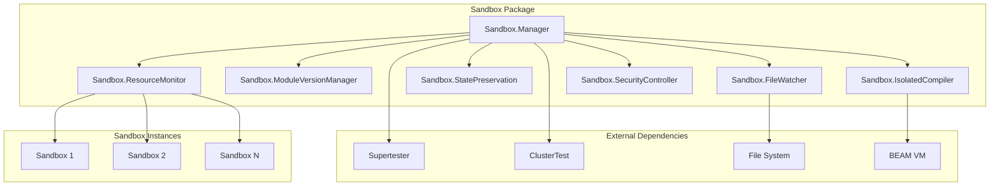

# Design Document

## Overview

This design document outlines the architecture for extracting and upgrading the sandbox functionality from SuperLearner into a standalone, production-ready Sandbox package. The design implements a "true sandbox architecture" that provides complete isolation, advanced hot-reload capabilities, and comprehensive testing infrastructure.

The extracted Sandbox package will be a complete OTP testing platform that combines the best aspects of the current SuperLearner sandbox system with significant architectural improvements for production use.

## Architecture

### High-Level Architecture



### Core Components

#### 1. Sandbox.Manager
The central orchestrator that manages sandbox lifecycle, coordinates between components, and provides the main API.

**Key Responsibilities:**
- Sandbox creation, destruction, and lifecycle management
- Coordination between all sandbox components
- ETS-based fast lookup and state management
- Process monitoring and cleanup
- API delegation and error handling

#### 2. Sandbox.IsolatedCompiler
Handles compilation of sandbox code in complete isolation with comprehensive safety mechanisms.

**Key Responsibilities:**
- Isolated compilation in separate processes
- Resource limits and timeout enforcement
- BEAM file validation and integrity checking
- Compilation artifact management
- Error reporting and recovery

#### 3. Sandbox.ModuleVersionManager
Manages module versions, hot-swapping, and dependency tracking.

**Key Responsibilities:**
- Module version tracking and storage
- Hot-swap coordination with state preservation
- Dependency analysis and reload ordering
- Rollback capabilities
- Version history management

#### 4. Sandbox.FileWatcher
Monitors file system changes and triggers automatic recompilation.

**Key Responsibilities:**
- Efficient file system monitoring
- Debounced compilation triggering
- Pattern-based file filtering
- Multi-sandbox watching coordination
- Performance optimization

#### 5. Sandbox.StatePreservation
Handles GenServer state preservation during hot-reloads.

**Key Responsibilities:**
- State capture and restoration
- Custom migration function support
- Supervisor child spec management
- State compatibility validation
- Migration error handling

#### 6. Sandbox.ResourceMonitor
Monitors and enforces resource limits for sandboxes.

**Key Responsibilities:**
- Real-time resource usage tracking
- Limit enforcement and alerting
- Performance metrics collection
- Resource cleanup coordination
- Security violation detection

#### 7. Sandbox.SecurityController
Provides security controls and code analysis for safe execution.

**Key Responsibilities:**
- Code security scanning
- Dangerous operation restriction
- Access control enforcement
- Audit logging
- Threat detection and response

## Components and Interfaces

### Sandbox.Manager Interface

```elixir
defmodule Sandbox.Manager do
  @type sandbox_info :: %{
    id: String.t(),
    status: :starting | :running | :stopping | :stopped | :error,
    app_name: atom(),
    supervisor_module: atom(),
    app_pid: pid(),
    supervisor_pid: pid(),
    created_at: DateTime.t(),
    restart_count: non_neg_integer(),
    resource_usage: map(),
    security_profile: map()
  }

  @type create_opts :: [
    supervisor_module: atom(),
    sandbox_path: String.t(),
    compile_timeout: non_neg_integer(),
    resource_limits: map(),
    security_profile: atom(),
    auto_reload: boolean(),
    state_migration: function()
  ]

  # Core API
  @spec create_sandbox(String.t(), atom() | String.t(), create_opts()) :: 
    {:ok, sandbox_info()} | {:error, term()}
  def create_sandbox(sandbox_id, module_or_app, opts \\ [])

  @spec destroy_sandbox(String.t()) :: :ok | {:error, term()}
  def destroy_sandbox(sandbox_id)

  @spec restart_sandbox(String.t()) :: {:ok, sandbox_info()} | {:error, term()}
  def restart_sandbox(sandbox_id)

  @spec get_sandbox_info(String.t()) :: {:ok, sandbox_info()} | {:error, :not_found}
  def get_sandbox_info(sandbox_id)

  @spec list_sandboxes() :: [sandbox_info()]
  def list_sandboxes()

  # Hot-reload API
  @spec hot_reload_sandbox(String.t(), binary(), keyword()) :: 
    {:ok, :hot_reloaded} | {:error, term()}
  def hot_reload_sandbox(sandbox_id, beam_data, opts \\ [])

  @spec enable_auto_reload(String.t()) :: :ok | {:error, term()}
  def enable_auto_reload(sandbox_id)

  @spec disable_auto_reload(String.t()) :: :ok | {:error, term()}
  def disable_auto_reload(sandbox_id)
end
```

### Sandbox.IsolatedCompiler Interface

```elixir
defmodule Sandbox.IsolatedCompiler do
  @type compile_info :: %{
    output: String.t(),
    beam_files: [String.t()],
    app_file: String.t(),
    compilation_time: non_neg_integer(),
    warnings: [String.t()],
    temp_dir: String.t()
  }

  @type compile_opts :: [
    timeout: non_neg_integer(),
    memory_limit: non_neg_integer(),
    validate_beams: boolean(),
    incremental: boolean(),
    env: map()
  ]

  @spec compile_sandbox(String.t(), compile_opts()) :: 
    {:ok, compile_info()} | {:error, term()}
  def compile_sandbox(sandbox_path, opts \\ [])

  @spec compile_file(String.t(), compile_opts()) :: 
    {:ok, compile_info()} | {:error, term()}
  def compile_file(file_path, opts \\ [])

  @spec incremental_compile(String.t(), [String.t()], compile_opts()) :: 
    {:ok, compile_info()} | {:error, term()}
  def incremental_compile(sandbox_path, changed_files, opts \\ [])

  @spec validate_beam_files([String.t()]) :: :ok | {:error, String.t()}
  def validate_beam_files(beam_files)

  @spec cleanup_artifacts(String.t()) :: :ok
  def cleanup_artifacts(temp_dir)
end
```

### Sandbox.ModuleVersionManager Interface

```elixir
defmodule Sandbox.ModuleVersionManager do
  @type module_version :: %{
    sandbox_id: String.t(),
    module: atom(),
    version: non_neg_integer(),
    beam_data: binary(),
    loaded_at: DateTime.t(),
    dependencies: [atom()],
    checksum: String.t()
  }

  @spec register_module_version(String.t(), atom(), binary()) :: 
    {:ok, non_neg_integer()} | {:error, term()}
  def register_module_version(sandbox_id, module, beam_data)

  @spec hot_swap_module(String.t(), atom(), binary(), keyword()) :: 
    {:ok, :hot_swapped} | {:error, term()}
  def hot_swap_module(sandbox_id, module, new_beam_data, opts \\ [])

  @spec rollback_module(String.t(), atom(), non_neg_integer()) :: 
    {:ok, :rolled_back} | {:error, term()}
  def rollback_module(sandbox_id, module, target_version)

  @spec get_current_version(String.t(), atom()) :: 
    {:ok, non_neg_integer()} | {:error, :not_found}
  def get_current_version(sandbox_id, module)

  @spec list_module_versions(String.t(), atom()) :: [module_version()]
  def list_module_versions(sandbox_id, module)

  @spec get_dependency_graph([atom()]) :: %{atom() => [atom()]}
  def get_dependency_graph(modules)

  @spec calculate_reload_order([atom()]) :: [atom()]
  def calculate_reload_order(modules)
end
```

## Data Models

### Sandbox State Model

```elixir
defmodule Sandbox.Models.SandboxState do
  @type t :: %__MODULE__{
    id: String.t(),
    status: sandbox_status(),
    app_name: atom(),
    supervisor_module: atom(),
    app_pid: pid() | nil,
    supervisor_pid: pid() | nil,
    monitor_ref: reference() | nil,
    created_at: DateTime.t(),
    updated_at: DateTime.t(),
    restart_count: non_neg_integer(),
    config: sandbox_config(),
    resource_usage: resource_usage(),
    security_profile: security_profile(),
    file_watcher_pid: pid() | nil,
    auto_reload_enabled: boolean(),
    compilation_artifacts: [String.t()]
  }

  @type sandbox_status :: 
    :initializing | :compiling | :starting | :running | 
    :reloading | :stopping | :stopped | :error

  @type sandbox_config :: %{
    sandbox_path: String.t(),
    compile_timeout: non_neg_integer(),
    resource_limits: resource_limits(),
    auto_reload: boolean(),
    state_migration_handler: function() | nil
  }

  @type resource_limits :: %{
    max_memory: non_neg_integer(),
    max_processes: non_neg_integer(),
    max_execution_time: non_neg_integer(),
    max_file_size: non_neg_integer(),
    max_cpu_percentage: float()
  }

  @type resource_usage :: %{
    current_memory: non_neg_integer(),
    current_processes: non_neg_integer(),
    cpu_usage: float(),
    uptime: non_neg_integer()
  }

  @type security_profile :: %{
    isolation_level: :high | :medium | :low,
    allowed_operations: [atom()],
    restricted_modules: [atom()],
    audit_level: :full | :basic | :none
  }
end
```

### Module Version Model

```elixir
defmodule Sandbox.Models.ModuleVersion do
  @type t :: %__MODULE__{
    sandbox_id: String.t(),
    module: atom(),
    version: non_neg_integer(),
    beam_data: binary(),
    source_checksum: String.t(),
    beam_checksum: String.t(),
    loaded_at: DateTime.t(),
    dependencies: [dependency()],
    metadata: map()
  }

  @type dependency :: %{
    module: atom(),
    type: :compile_time | :runtime | :optional,
    version_constraint: String.t() | nil
  }
end
```

### Compilation Result Model

```elixir
defmodule Sandbox.Models.CompilationResult do
  @type t :: %__MODULE__{
    status: :success | :failure,
    output: String.t(),
    beam_files: [String.t()],
    app_file: String.t() | nil,
    warnings: [warning()],
    errors: [error()],
    compilation_time: non_neg_integer(),
    temp_dir: String.t(),
    incremental: boolean()
  }

  @type warning :: %{
    file: String.t(),
    line: non_neg_integer(),
    message: String.t()
  }

  @type error :: %{
    file: String.t(),
    line: non_neg_integer(),
    message: String.t(),
    type: :syntax | :compile | :dependency
  }
end
```

## Error Handling

### Error Classification and Recovery

```elixir
defmodule Sandbox.ErrorHandler do
  @type error_category :: 
    :compilation_error | :runtime_error | :resource_error | 
    :security_error | :system_error

  @type recovery_strategy :: 
    :retry | :rollback | :restart | :isolate | :terminate

  @type error_context :: %{
    sandbox_id: String.t(),
    operation: atom(),
    component: atom(),
    timestamp: DateTime.t(),
    metadata: map()
  }

  @spec handle_error(term(), error_context()) :: 
    {:ok, recovery_strategy()} | {:error, :unrecoverable}
  def handle_error(error, context)

  @spec classify_error(term()) :: error_category()
  def classify_error(error)

  @spec suggest_recovery(error_category(), error_context()) :: recovery_strategy()
  def suggest_recovery(category, context)
end
```

### Comprehensive Error Recovery

1. **Compilation Errors**: Show detailed error messages, preserve sandbox state
2. **Runtime Errors**: Automatic rollback to last known good state
3. **Resource Errors**: Enforce limits, cleanup resources, alert operators
4. **Security Errors**: Immediate isolation, audit logging, alert security team
5. **System Errors**: Graceful degradation, comprehensive logging, recovery attempts

## Testing Strategy

### Integration with Supertester

The Sandbox package will fully integrate with Supertester to provide OTP-compliant testing patterns:

```elixir
defmodule Sandbox.Test.Helpers do
  @moduledoc """
  Supertester integration helpers for sandbox testing.
  """

  import Supertester.OTPHelpers
  import Supertester.GenServerHelpers
  import Supertester.Assertions

  @spec setup_test_sandbox(String.t(), atom(), keyword()) :: 
    {:ok, pid()} | {:error, term()}
  def setup_test_sandbox(test_name, supervisor_module, opts \\ [])

  @spec assert_sandbox_running(String.t()) :: :ok
  def assert_sandbox_running(sandbox_id)

  @spec assert_hot_reload_successful(String.t(), atom()) :: :ok
  def assert_hot_reload_successful(sandbox_id, module)

  @spec wait_for_compilation(String.t(), non_neg_integer()) :: :ok | {:error, :timeout}
  def wait_for_compilation(sandbox_id, timeout \\ 5000)

  @spec stress_test_sandbox(String.t(), [operation()], non_neg_integer()) :: 
    {:ok, test_results()} | {:error, term()}
  def stress_test_sandbox(sandbox_id, operations, duration_ms)
end
```

### Test Categories

1. **Unit Tests**: Individual component testing with mocked dependencies
2. **Integration Tests**: Component interaction testing with real processes
3. **Performance Tests**: Resource usage, compilation speed, hot-reload timing
4. **Security Tests**: Code scanning, resource limits, isolation verification
5. **Distributed Tests**: Multi-node scenarios with ClusterTest integration
6. **Stress Tests**: High load, concurrent operations, resource exhaustion

### Testing Standards Compliance

- **Zero Process.sleep/1**: All tests use OTP synchronization patterns
- **Async Testing**: All tests run with `async: true` using proper isolation
- **Supertester Integration**: Full use of Supertester helpers and assertions
- **Performance Targets**: Complete test suite runs in under 30 seconds
- **No Process Leaks**: Comprehensive cleanup verification
- **Educational Value**: Tests demonstrate proper OTP patterns

## Performance Optimization

### Compilation Performance

1. **Incremental Compilation**: Only recompile changed modules
2. **Compilation Caching**: Cache compiled artifacts by source hash
3. **Parallel Compilation**: Compile independent modules simultaneously
4. **Dependency Optimization**: Smart dependency analysis and reload ordering

### Runtime Performance

1. **ETS Optimization**: Fast lookups for sandbox and module information
2. **Process Pooling**: Reuse compilation processes where possible
3. **Memory Management**: Efficient cleanup and garbage collection
4. **Resource Monitoring**: Lightweight monitoring with configurable intervals

### Hot-Reload Performance

1. **State Preservation**: Minimize state capture/restore overhead
2. **Dependency Analysis**: Efficient dependency graph calculation
3. **Atomic Operations**: Minimize downtime during module swapping
4. **Rollback Optimization**: Fast rollback with pre-computed snapshots

## Security Architecture

### Multi-Layer Security

1. **Code Analysis**: Static analysis for dangerous patterns
2. **Resource Limits**: Strict enforcement of memory, CPU, and process limits
3. **Operation Restrictions**: Whitelist/blacklist of allowed operations
4. **Audit Logging**: Comprehensive logging of all security-relevant events
5. **Isolation Enforcement**: Verify and maintain sandbox boundaries

### Security Profiles

```elixir
@security_profiles %{
  high: %{
    isolation_level: :high,
    max_memory: 64 * 1024 * 1024,  # 64MB
    max_processes: 50,
    max_execution_time: 60_000,    # 1 minute
    allowed_operations: [:basic_otp, :math, :string],
    audit_level: :full
  },
  medium: %{
    isolation_level: :medium,
    max_memory: 128 * 1024 * 1024, # 128MB
    max_processes: 100,
    max_execution_time: 300_000,   # 5 minutes
    allowed_operations: [:basic_otp, :file_read, :network_client],
    audit_level: :basic
  },
  low: %{
    isolation_level: :low,
    max_memory: 256 * 1024 * 1024, # 256MB
    max_processes: 200,
    max_execution_time: 600_000,   # 10 minutes
    allowed_operations: [:all],
    audit_level: :basic
  }
}
```

## Integration Points

### Supertester Integration

The Sandbox package will provide seamless integration with Supertester for comprehensive OTP testing:

- **Test Helpers**: Sandbox-specific test utilities following Supertester patterns
- **Assertions**: Custom assertions for sandbox state and behavior verification
- **Process Management**: Integration with Supertester's process lifecycle helpers
- **Performance Testing**: Stress testing utilities using Supertester's performance helpers

### ClusterTest Integration

For distributed testing scenarios:

- **Multi-Node Sandboxes**: Sandboxes that span multiple nodes
- **Cluster Coordination**: Integration with ClusterTest for node management
- **Distributed Hot-Reload**: Hot-reload across cluster nodes
- **Network Partition Testing**: Sandbox behavior during network partitions

### External Tool Integration

- **IDE Integration**: APIs for editor plugins and development tools
- **Monitoring Integration**: Telemetry events for external monitoring systems
- **CI/CD Integration**: Automated testing and deployment support
- **Logging Integration**: Structured logging compatible with log aggregation systems

## Migration Strategy

### Phase 1: Core Extraction (Weeks 1-2)
1. Extract SandboxManager, IsolatedCompiler, and ModuleVersionManager
2. Implement basic hot-reload functionality
3. Add Supertester integration and testing infrastructure
4. Create comprehensive test suite

### Phase 2: Advanced Features (Weeks 3-4)
1. Implement FileWatcher and auto-reload
2. Add StatePreservation with migration support
3. Implement ResourceMonitor and SecurityController
4. Add performance optimizations

### Phase 3: Production Features (Weeks 5-6)
1. Add distributed sandbox support
2. Implement advanced security features
3. Add comprehensive monitoring and telemetry
4. Performance tuning and optimization

### Phase 4: Integration and Polish (Week 7)
1. Complete ClusterTest integration
2. Add external tool integration APIs
3. Comprehensive documentation and examples
4. Final testing and performance validation

## Success Metrics

### Functionality Metrics
- ✅ Hot-reload completes in <1 second
- ✅ Compilation failures don't affect other sandboxes
- ✅ State preserved across reloads (when possible)
- ✅ Automatic rollback on failures
- ✅ 100+ concurrent sandboxes supported

### Performance Metrics
- ✅ Memory usage <50MB per sandbox base overhead
- ✅ File watching overhead <1% CPU
- ✅ Test suite completes in <30 seconds
- ✅ No memory leaks over extended use
- ✅ Zero Process.sleep/1 in tests

### Quality Metrics
- ✅ 100% test coverage for core functionality
- ✅ All tests use async: true
- ✅ Comprehensive error handling and recovery
- ✅ Production-ready monitoring and alerting
- ✅ Complete Supertester integration