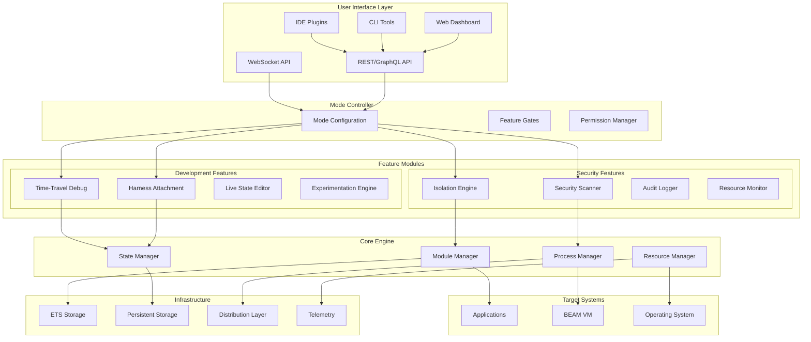
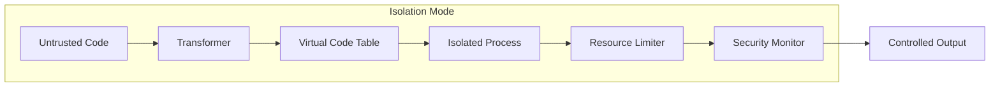
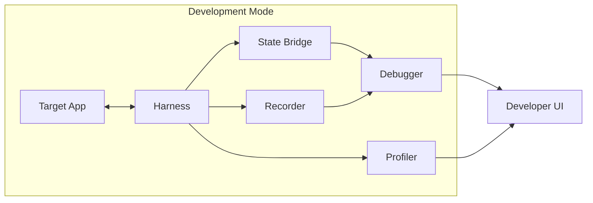
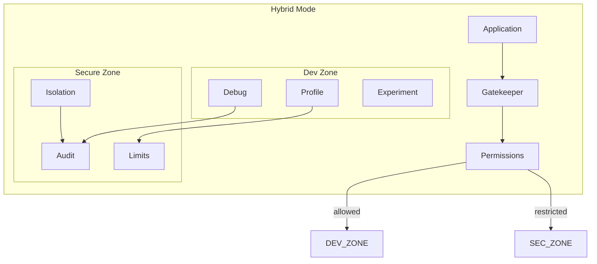
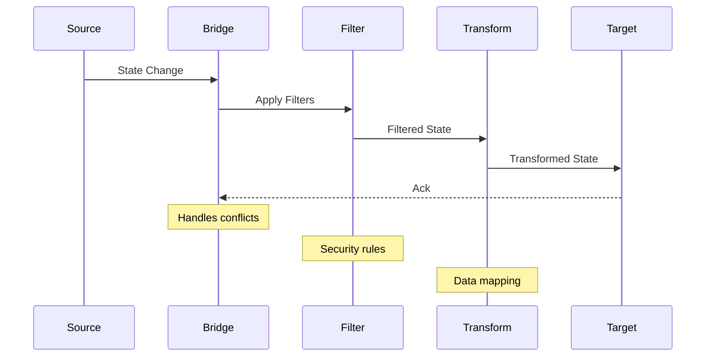
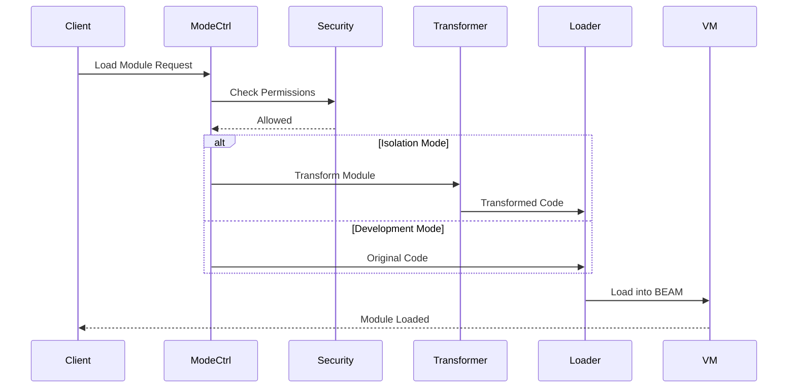

# Apex Platform - Architecture

## System Architecture

### High-Level Architecture



### Component Layers

#### 1. User Interface Layer
Provides multiple interaction methods for different use cases and preferences.

```elixir
defmodule Apex.UI do
  @moduledoc """
  Unified interface layer supporting multiple interaction methods.
  """
  
  @type interface :: :web | :cli | :api | :ide
  @type request :: %{
    interface: interface(),
    action: atom(),
    params: map(),
    auth: map()
  }
end
```

#### 2. Mode Controller
Central orchestrator that configures platform behavior based on operational mode.

```elixir
defmodule Apex.ModeController do
  @type mode :: :isolation | :development | :hybrid
  @type feature :: atom()
  @type permission :: atom()
  
  @spec configure(mode(), keyword()) :: {:ok, configuration()} | {:error, term()}
  def configure(mode, opts \\ []) do
    base_config = load_mode_defaults(mode)
    user_config = Keyword.get(opts, :config, %{})
    features = resolve_features(mode, opts[:features])
    permissions = resolve_permissions(mode, opts[:permissions])
    
    %{
      mode: mode,
      features: features,
      permissions: permissions,
      config: Map.merge(base_config, user_config)
    }
  end
end
```

#### 3. Core Engine
Shared infrastructure used by all modes and features.

```elixir
defmodule Apex.Core do
  @moduledoc """
  Core engine providing fundamental services for all modes.
  """
  
  defmodule ModuleManager do
    @type load_opts :: [
      transform: boolean(),
      namespace: String.t(),
      version: String.t()
    ]
    
    @spec load_module(module(), binary(), load_opts()) :: {:ok, module()} | {:error, term()}
  end
  
  defmodule StateManager do
    @type sync_strategy :: :eager | :lazy | :periodic | :manual
    
    @spec create_bridge(source :: term(), target :: term(), sync_strategy()) :: {:ok, pid()}
    @spec capture_state(term()) :: {:ok, state_snapshot()}
    @spec restore_state(term(), state_snapshot()) :: :ok | {:error, term()}
  end
  
  defmodule ProcessManager do
    @type isolation_level :: :none | :partial | :full
    
    @spec create_isolated_process(module(), function(), args :: list(), isolation_level()) :: {:ok, pid()}
    @spec monitor_process(pid(), monitors :: list()) :: {:ok, monitor_ref()}
  end
end
```

### Mode-Specific Architectures

#### Isolation Mode Architecture



**Key Components:**
- Module transformation prevents namespace conflicts
- Process isolation ensures fault containment
- Virtual code tables provide module isolation
- Resource limits prevent system abuse
- Security monitoring detects violations

#### Development Mode Architecture



**Key Components:**
- Direct attachment with minimal overhead
- Bidirectional state synchronization
- Comprehensive recording for replay
- Interactive debugging interface
- Real-time profiling

#### Hybrid Mode Architecture



**Key Components:**
- Permission-based feature access
- Selective isolation for security
- Audited development operations
- Resource limits with overrides
- Configurable security policies

### Data Flow Architecture

#### State Synchronization Flow



#### Module Loading Flow



### Deployment Architectures

#### Single-Node Deployment

```elixir
defmodule Apex.Deployment.Single do
  @moduledoc """
  Single-node deployment suitable for development and small-scale production.
  """
  
  def topology do
    %{
      node: node(),
      components: [
        {Apex.Supervisor, []},
        {Apex.ModeController, [mode: :hybrid]},
        {Apex.Core.ModuleManager, []},
        {Apex.Core.StateManager, []},
        {Apex.Core.ProcessManager, []},
        {Apex.Storage.ETS, []},
        {Apex.Telemetry, []}
      ]
    }
  end
end
```

#### Multi-Node Cluster

```elixir
defmodule Apex.Deployment.Cluster do
  @moduledoc """
  Distributed deployment for high-availability and scale.
  """
  
  def topology do
    %{
      orchestrator: [
        nodes: [:apex_orchestrator@host1],
        components: [
          Apex.Cluster.Orchestrator,
          Apex.Cluster.Registry,
          Apex.Cluster.LoadBalancer
        ]
      ],
      workers: [
        nodes: [:apex_worker1@host2, :apex_worker2@host3],
        components: [
          Apex.Worker.Supervisor,
          Apex.Worker.Executor,
          Apex.Worker.ResourceManager
        ]
      ],
      storage: [
        nodes: [:apex_storage@host4],
        components: [
          Apex.Storage.Distributed,
          Apex.Storage.Replication
        ]
      ]
    }
  end
end
```

#### Cloud-Native Deployment

```yaml
# kubernetes/apex-platform.yaml
apiVersion: apps/v1
kind: Deployment
metadata:
  name: apex-platform
spec:
  replicas: 3
  selector:
    matchLabels:
      app: apex
  template:
    metadata:
      labels:
        app: apex
    spec:
      containers:
      - name: apex
        image: apex/platform:2.0
        env:
        - name: APEX_MODE
          value: "hybrid"
        - name: APEX_CLUSTER_ENABLED
          value: "true"
        ports:
        - containerPort: 4000  # API
        - containerPort: 4369  # EPMD
        - containerPort: 9001  # Distribution
```

### Communication Protocols

#### Internal Communication

```elixir
defmodule Apex.Protocol.Internal do
  @moduledoc """
  Binary protocol for efficient internal communication.
  """
  
  @magic_bytes <<0xAP, 0xEX>>
  @version 1
  
  defstruct [
    :id,
    :type,
    :source,
    :target,
    :payload,
    :metadata
  ]
  
  def encode(%__MODULE__{} = msg) do
    payload = :erlang.term_to_binary(msg.payload)
    metadata = :erlang.term_to_binary(msg.metadata)
    
    <<
      @magic_bytes::binary,
      @version::8,
      msg.id::binary-size(16),
      type_to_byte(msg.type)::8,
      byte_size(payload)::32,
      byte_size(metadata)::32,
      payload::binary,
      metadata::binary
    >>
  end
end
```

#### External API

```elixir
defmodule Apex.Protocol.API do
  @moduledoc """
  REST and GraphQL API specifications.
  """
  
  # REST endpoints
  def routes do
    [
      # Sandbox management
      {:post, "/api/v2/sandboxes", :create_sandbox},
      {:get, "/api/v2/sandboxes/:id", :get_sandbox},
      {:put, "/api/v2/sandboxes/:id", :update_sandbox},
      {:delete, "/api/v2/sandboxes/:id", :delete_sandbox},
      
      # Development features
      {:post, "/api/v2/attach", :attach_to_app},
      {:post, "/api/v2/debug/record", :start_recording},
      {:post, "/api/v2/experiments", :create_experiment},
      
      # Monitoring
      {:get, "/api/v2/metrics", :get_metrics},
      {:get, "/api/v2/health", :health_check}
    ]
  end
  
  # GraphQL schema
  def graphql_schema do
    """
    type Sandbox {
      id: ID!
      mode: Mode!
      status: Status!
      modules: [Module!]!
      resources: ResourceUsage!
      created: DateTime!
    }
    
    type Query {
      sandbox(id: ID!): Sandbox
      sandboxes(filter: SandboxFilter): [Sandbox!]!
    }
    
    type Mutation {
      createSandbox(input: CreateSandboxInput!): Sandbox!
      executeCode(sandboxId: ID!, code: String!): ExecutionResult!
    }
    """
  end
end
```

### Storage Architecture

#### Storage Layers

```elixir
defmodule Apex.Storage do
  @moduledoc """
  Multi-tier storage architecture for different data types and access patterns.
  """
  
  # Hot storage - ETS for frequently accessed data
  defmodule Hot do
    @tables [
      {:apex_modules, [:set, :public, {:read_concurrency, true}]},
      {:apex_state, [:set, :public, {:write_concurrency, true}]},
      {:apex_metrics, [:ordered_set, :public]},
      {:apex_sessions, [:set, :public, {:write_concurrency, true}]}
    ]
  end
  
  # Warm storage - Mnesia for distributed state
  defmodule Warm do
    @tables [
      {:apex_config, [:set, :disc_copies], record_name: :config},
      {:apex_audit, [:bag, :disc_copies], record_name: :audit},
      {:apex_snapshots, [:set, :disc_only_copies], record_name: :snapshot}
    ]
  end
  
  # Cold storage - External for archives
  defmodule Cold do
    @adapters [
      {:s3, Apex.Storage.Adapters.S3},
      {:postgresql, Apex.Storage.Adapters.PostgreSQL},
      {:filesystem, Apex.Storage.Adapters.FileSystem}
    ]
  end
end
```

### Security Architecture

#### Security Layers

```mermaid
graph TB
    subgraph "Security Architecture"
        REQ[Request]
        
        subgraph "Access Control"
            AUTH[Authentication]
            AUTHZ[Authorization]
            RBAC[Role-Based Access]
        end
        
        subgraph "Runtime Security"
            VAL[Input Validation]
            SCAN[Code Scanning]
            ISO[Process Isolation]
            MON[Security Monitoring]
        end
        
        subgraph "Data Security"
            ENC[Encryption]
            MASK[Data Masking]
            AUD[Audit Trail]
        end
        
        RESP[Response]
    end
    
    REQ --> AUTH
    AUTH --> AUTHZ
    AUTHZ --> RBAC
    RBAC --> VAL
    VAL --> SCAN
    SCAN --> ISO
    ISO --> MON
    MON --> ENC
    ENC --> MASK
    MASK --> AUD
    AUD --> RESP
```



### Performance Architecture

#### Resource Management

```elixir
defmodule Apex.Performance.Resources do
  @resource_pools %{
    processes: %{
      isolation: 10_000,
      development: 50_000,
      hybrid: 25_000
    },
    memory: %{
      isolation: "1GB",
      development: "4GB",
      hybrid: "2GB"
    },
    ets_tables: %{
      isolation: 100,
      development: 1000,
      hybrid: 500
    }
  }
  
  def allocate(mode, resource_type) do
    limit = get_in(@resource_pools, [resource_type, mode])
    {:ok, limit}
  end
end
```

#### Performance Optimizations

1. **Lazy Loading**: Components initialize only when first used
2. **Connection Pooling**: Reuse connections for distributed operations
3. **Caching Strategy**: Multi-level caching with TTL and LRU eviction
4. **Batch Operations**: Group similar operations for efficiency
5. **Async Processing**: Non-blocking operations with backpressure

### Monitoring and Observability

```elixir
defmodule Apex.Observability do
  @metrics [
    # Counters
    "apex.sandbox.created.count",
    "apex.execution.count",
    "apex.errors.count",
    
    # Gauges
    "apex.sandboxes.active",
    "apex.memory.used",
    "apex.processes.count",
    
    # Histograms
    "apex.execution.duration",
    "apex.compilation.duration",
    "apex.attachment.duration"
  ]
  
  @traces [
    "apex.request",
    "apex.sandbox.lifecycle",
    "apex.module.load",
    "apex.state.sync"
  ]
  
  @logs [
    :info,
    :warning,
    :error,
    :security,
    :audit
  ]
end
```

## Next Steps

1. Explore [Core Components](03_core_components.md) for detailed specifications
2. Learn about [Operational Modes](04_operational_modes.md) configuration
3. Check [Integration Guide](05_integration_guide.md) for framework support
4. Review [Security Model](06_security_model.md) for policies
5. See [Development Tools](07_development_tools.md) for debugging features