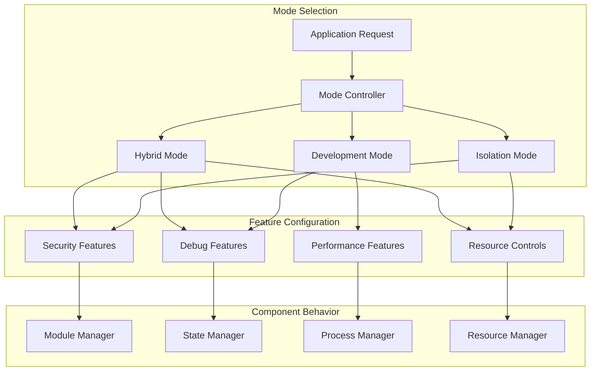

# Apex Platform - Operational Modes

## Overview

The Apex Platform provides three operational modes that configure the behavior of all components to match specific use cases. This document details each mode's characteristics, configuration options, and usage patterns.

## Mode Architecture



## Isolation Mode

### Purpose
Provides maximum security for running untrusted or third-party code with strict isolation and resource controls.

### Characteristics

```elixir
defmodule Apex.Modes.Isolation do
  @moduledoc """
  Configuration and behavior for isolation mode.
  """
  
  @mode_config %{
    # Security settings
    security: %{
      module_transformation: :required,
      code_scanning: :strict,
      dangerous_operations: :forbidden,
      audit_level: :full
    },
    
    # Resource limits
    resources: %{
      memory: {:limit, 100_000_000},      # 100MB
      cpu: {:limit, 50},                   # 50%
      processes: {:limit, 1_000},
      ets_tables: {:limit, 50},
      ports: {:limit, 0},                  # No port access
      files: {:limit, 0}                   # No file access
    },
    
    # Process isolation
    process: %{
      isolation_level: :full,
      message_passing: :filtered,
      error_propagation: :contained,
      supervision: :isolated_tree
    },
    
    # Module management
    modules: %{
      namespace_isolation: true,
      hot_reload: :restricted,
      dependency_checking: :strict,
      version_conflicts: :prevent
    },
    
    # State management
    state: %{
      access: :read_only,
      synchronization: :disabled,
      manipulation: :forbidden,
      persistence: :sandboxed
    },
    
    # Development features
    development: %{
      debugging: :disabled,
      profiling: :basic,
      experimentation: :sandboxed_only,
      time_travel: :disabled
    }
  }
  
  def apply(sandbox_config) do
    Map.merge(@mode_config, sandbox_config)
  end
end
```

### Use Cases

#### 1. Multi-Tenant SaaS
```elixir
defmodule TenantSandbox do
  def create_tenant_sandbox(tenant_id, code) do
    Apex.create(
      "tenant_#{tenant_id}",
      code,
      mode: :isolation,
      resources: %{
        memory: "50MB",
        cpu: 25,
        timeout: 30_000
      },
      security: %{
        allowed_modules: [:Enum, :Map, :List, :String],
        network_access: false
      }
    )
  end
end
```

#### 2. Plugin System
```elixir
defmodule PluginSandbox do
  def load_plugin(plugin) do
    Apex.create(
      plugin.id,
      plugin.code,
      mode: :isolation,
      modules: %{
        namespace: "Plugin.#{plugin.id}",
        api_modules: [PluginAPI]
      },
      callbacks: %{
        on_error: &handle_plugin_error/2,
        on_timeout: &terminate_plugin/1
      }
    )
  end
end
```

#### 3. Educational Platform
```elixir
defmodule StudentSandbox do
  def create_exercise_sandbox(student_id, exercise_id) do
    Apex.create(
      "student_#{student_id}_ex_#{exercise_id}",
      exercise_template(),
      mode: :isolation,
      resources: %{
        memory: "25MB",
        cpu: 10,
        execution_time: 5_000
      },
      output: %{
        max_size: 1_000_000,  # 1MB output
        format: :structured
      }
    )
  end
end
```

### Security Policies

```elixir
defmodule Apex.Modes.Isolation.Security do
  @forbidden_modules [
    :os, :System, :File, :Port, :Node, 
    :Code, :Application, :Config
  ]
  
  @forbidden_functions [
    {:erlang, :halt, 0},
    {:erlang, :halt, 1},
    {:erlang, :spawn_opt, 3},
    {:Process, :exit, 2},
    {:System, :cmd, 1},
    {:File, :write, 2}
  ]
  
  def scan_code(ast) do
    violations = []
    |> check_forbidden_modules(ast)
    |> check_forbidden_functions(ast)
    |> check_dangerous_patterns(ast)
    
    case violations do
      [] -> :ok
      _ -> {:error, {:security_violations, violations}}
    end
  end
end
```

## Development Mode

### Purpose
Provides maximum developer productivity with unrestricted access to debugging, profiling, and experimentation features.

### Characteristics

```elixir
defmodule Apex.Modes.Development do
  @moduledoc """
  Configuration and behavior for development mode.
  """
  
  @mode_config %{
    # Security settings
    security: %{
      module_transformation: :disabled,
      code_scanning: :advisory,
      dangerous_operations: :allowed_with_warning,
      audit_level: :minimal
    },
    
    # Resource limits
    resources: %{
      memory: :unlimited,
      cpu: :unlimited,
      processes: :unlimited,
      ets_tables: :unlimited,
      ports: :unlimited,
      files: :unlimited
    },
    
    # Process management
    process: %{
      isolation_level: :none,
      message_passing: :unrestricted,
      error_propagation: :transparent,
      supervision: :shared_tree
    },
    
    # Module management
    modules: %{
      namespace_isolation: false,
      hot_reload: :unrestricted,
      dependency_checking: :relaxed,
      version_conflicts: :allow_override
    },
    
    # State management
    state: %{
      access: :read_write,
      synchronization: :bidirectional,
      manipulation: :unrestricted,
      persistence: :shared
    },
    
    # Development features
    development: %{
      debugging: :full,
      profiling: :comprehensive,
      experimentation: :direct_execution,
      time_travel: :enabled,
      collaboration: :enabled
    }
  }
  
  def apply(sandbox_config) do
    # Development mode allows all features
    Map.merge(@mode_config, sandbox_config)
  end
end
```

### Use Cases

#### 1. Local Development
```elixir
defmodule DevEnvironment do
  def attach_to_app do
    Apex.attach(
      MyApp,
      mode: :development,
      features: [
        :live_reload,
        :state_inspection,
        :performance_profiling,
        :time_travel_debugging
      ],
      ui: %{
        web_port: 4001,
        enable_dashboard: true
      }
    )
  end
end
```

#### 2. Production Debugging
```elixir
defmodule ProductionDebug do
  def debug_production_issue(node) do
    Apex.attach(
      node,
      mode: :development,
      features: [:read_only_inspection, :trace_messages, :profile],
      safety: %{
        read_only: true,
        timeout: 300_000,  # 5 minutes
        auto_detach: true
      }
    )
  end
end
```

#### 3. Performance Optimization
```elixir
defmodule PerformanceWork do
  def profile_and_optimize(module) do
    {:ok, session} = Apex.attach(MyApp, mode: :development)
    
    # Profile current implementation
    baseline = Apex.Performance.profile(session, module)
    
    # Create experiment
    experiment = Apex.Experimentation.create(session, "optimization")
    Apex.Experimentation.add_variant(experiment, :current, current_code)
    Apex.Experimentation.add_variant(experiment, :optimized, new_code)
    
    # Compare
    results = Apex.Experimentation.run(experiment, test_data)
  end
end
```

### Development Features

```elixir
defmodule Apex.Modes.Development.Features do
  @features %{
    time_travel: %{
      recording: :automatic,
      retention: {:hours, 24},
      compression: :lz4,
      replay_speed: :variable
    },
    
    debugging: %{
      breakpoints: :unlimited,
      stepping: [:into, :over, :out],
      inspection: :deep,
      modification: :allowed
    },
    
    profiling: %{
      cpu: [:sampling, :tracing],
      memory: [:allocation, :gc],
      io: [:disk, :network],
      custom: :pluggable
    },
    
    experimentation: %{
      variants: :unlimited,
      execution: :parallel,
      comparison: :statistical,
      rollout: :percentage_based
    }
  }
  
  def enable_feature(feature, config \\ %{}) do
    Map.merge(@features[feature], config)
  end
end
```

## Hybrid Mode

### Purpose
Provides a balanced approach with configurable security and development features based on permissions and requirements.

### Characteristics

```elixir
defmodule Apex.Modes.Hybrid do
  @moduledoc """
  Configuration and behavior for hybrid mode with flexible policies.
  """
  
  @mode_config %{
    # Security settings (configurable)
    security: %{
      module_transformation: :optional,
      code_scanning: :configurable,
      dangerous_operations: :permission_based,
      audit_level: :selective
    },
    
    # Resource limits (configurable)
    resources: %{
      memory: {:configurable, 500_000_000},  # 500MB default
      cpu: {:configurable, 80},              # 80% default
      processes: {:configurable, 10_000},
      ets_tables: {:configurable, 500},
      ports: {:configurable, 10},
      files: {:permission_based, []}
    },
    
    # Process management (mixed)
    process: %{
      isolation_level: :selective,
      message_passing: :monitored,
      error_propagation: :configurable,
      supervision: :mixed_tree
    },
    
    # Module management (flexible)
    modules: %{
      namespace_isolation: :optional,
      hot_reload: :permission_based,
      dependency_checking: :configurable,
      version_conflicts: :warn_and_proceed
    },
    
    # State management (controlled)
    state: %{
      access: :permission_based,
      synchronization: :filtered,
      manipulation: :audited,
      persistence: :segregated
    },
    
    # Development features (gated)
    development: %{
      debugging: :permission_based,
      profiling: :allowed,
      experimentation: :sandboxed_with_promotion,
      time_travel: :read_only,
      collaboration: :team_based
    }
  }
  
  def apply(sandbox_config, permissions) do
    config = Map.merge(@mode_config, sandbox_config)
    apply_permissions(config, permissions)
  end
  
  defp apply_permissions(config, permissions) do
    # Apply permission-based restrictions
    Enum.reduce(permissions, config, fn {feature, permission}, acc ->
      apply_permission(acc, feature, permission)
    end)
  end
end
```

### Permission System

```elixir
defmodule Apex.Modes.Hybrid.Permissions do
  @type role :: :admin | :developer | :tester | :viewer
  @type permission :: :allow | :deny | :audit | {:conditional, condition()}
  @type condition :: function() | {module(), atom(), list()}
  
  @role_permissions %{
    admin: %{
      state_manipulation: :allow,
      code_execution: :allow,
      resource_override: :allow,
      security_bypass: :audit
    },
    developer: %{
      state_manipulation: :audit,
      code_execution: :allow,
      debugging: :allow,
      experimentation: :allow
    },
    tester: %{
      state_inspection: :allow,
      debugging: :allow,
      experimentation: {:conditional, &in_test_env?/0},
      profiling: :allow
    },
    viewer: %{
      state_inspection: :allow,
      metrics_access: :allow,
      debugging: :deny,
      code_execution: :deny
    }
  }
  
  def check_permission(role, action, context \\ %{}) do
    permission = get_in(@role_permissions, [role, action]) || :deny
    
    case permission do
      :allow -> :ok
      :deny -> {:error, :permission_denied}
      :audit -> audit_and_allow(role, action, context)
      {:conditional, condition} -> check_condition(condition, context)
    end
  end
end
```

### Use Cases

#### 1. Team Development Environment
```elixir
defmodule TeamSandbox do
  def create_team_workspace(team_id) do
    Apex.create(
      "team_#{team_id}",
      TeamApp,
      mode: :hybrid,
      permissions: %{
        developers: [
          :debugging,
          :profiling,
          :hot_reload,
          {:state_edit, audit: true}
        ],
        testers: [
          :debugging,
          :state_inspection,
          :experimentation
        ],
        viewers: [
          :metrics,
          :logs,
          :state_inspection
        ]
      },
      resources: %{
        memory: "2GB",
        cpu: 80,
        override_allowed: [:admin]
      }
    )
  end
end
```

#### 2. Staging Environment
```elixir
defmodule StagingSandbox do
  def create_staging_env do
    Apex.create(
      "staging",
      MyApp,
      mode: :hybrid,
      config: %{
        isolation: %{
          network: true,
          filesystem: true,
          processes: false
        },
        development: %{
          debugging: true,
          profiling: true,
          hot_reload: false
        },
        security: %{
          audit_all: true,
          scan_uploads: true
        }
      }
    )
  end
end
```

#### 3. Customer Demo Environment
```elixir
defmodule DemoSandbox do
  def create_demo(customer_id) do
    Apex.create(
      "demo_#{customer_id}",
      DemoApp,
      mode: :hybrid,
      features: %{
        data_isolation: true,
        debugging: {:allowed_for, [:support_team]},
        reset_capability: true,
        time_limit: {:hours, 48}
      },
      customization: %{
        branding: customer_branding(customer_id),
        data_set: :demo,
        integrations: :mocked
      }
    )
  end
end
```

### Configuration Strategies

```elixir
defmodule Apex.Modes.Hybrid.Strategies do
  # Progressive security relaxation
  def development_progression do
    [
      # Start secure
      %{phase: :initial, transform: true, limits: :strict},
      # Relax for development
      %{phase: :development, transform: false, limits: :relaxed},
      # Tighten for staging
      %{phase: :staging, transform: true, limits: :moderate},
      # Full security for production
      %{phase: :production, transform: true, limits: :strict}
    ]
  end
  
  # Feature gating
  def feature_gates do
    %{
      time_travel: &has_permission?(&1, :time_travel),
      state_edit: &has_permission?(&1, :state_edit) and &in_dev_env?/0,
      hot_reload: &has_permission?(&1, :hot_reload) and &safe_module?/1,
      profiling: &resource_available?(:cpu, 20)  # Need 20% CPU headroom
    }
  end
  
  # Dynamic adjustment
  def auto_adjust(metrics) do
    cond do
      metrics.error_rate > 0.1 -> increase_isolation()
      metrics.cpu_usage > 0.9 -> enable_resource_limits()
      metrics.memory_pressure -> reduce_features()
      true -> :no_change
    end
  end
end
```

## Mode Transitions

### Switching Between Modes

```elixir
defmodule Apex.Modes.Transition do
  @moduledoc """
  Handles safe transitions between operational modes.
  """
  
  @type transition :: {:ok, new_mode()} | {:error, reason()}
  
  @spec transition(sandbox(), from_mode(), to_mode(), opts()) :: transition()
  def transition(sandbox, from, to, opts \\ []) do
    with :ok <- validate_transition(from, to),
         :ok <- check_requirements(sandbox, to),
         {:ok, state} <- prepare_transition(sandbox, from, to),
         :ok <- apply_transition(sandbox, to, state),
         :ok <- cleanup_old_mode(sandbox, from) do
      
      {:ok, to}
    end
  end
  
  # Some transitions require special handling
  defp validate_transition(:development, :isolation) do
    # Must clean up development artifacts
    {:ok, :requires_cleanup}
  end
  
  defp validate_transition(:isolation, :development) do
    # Must relax security first
    {:ok, :requires_permission}
  end
  
  defp validate_transition(_, :hybrid) do
    # Always allowed to transition to hybrid
    :ok
  end
  
  @spec hot_transition(sandbox(), to_mode()) :: transition()
  def hot_transition(sandbox, to_mode) do
    # Transition without stopping sandbox
    current_mode = get_current_mode(sandbox)
    
    # Create transition plan
    plan = create_transition_plan(current_mode, to_mode)
    
    # Execute plan steps
    Enum.reduce_while(plan, {:ok, current_mode}, fn step, {:ok, mode} ->
      case execute_step(sandbox, step) do
        :ok -> {:cont, {:ok, mode}}
        error -> {:halt, error}
      end
    end)
  end
end
```

### Mode Detection

```elixir
defmodule Apex.Modes.Detection do
  @moduledoc """
  Automatic mode detection based on usage patterns.
  """
  
  def suggest_mode(usage_patterns) do
    cond do
      high_security_required?(usage_patterns) -> :isolation
      development_patterns?(usage_patterns) -> :development
      true -> :hybrid
    end
  end
  
  defp high_security_required?(patterns) do
    patterns.untrusted_code or
    patterns.multi_tenant or
    patterns.external_code
  end
  
  defp development_patterns?(patterns) do
    patterns.debugging or
    patterns.profiling or
    patterns.local_environment
  end
  
  def auto_configure(detected_mode, context) do
    base_config = Apex.Modes.config(detected_mode)
    
    adjustments = case context do
      %{environment: :production} ->
        %{security: %{level: :increase}}
        
      %{team_size: size} when size > 10 ->
        %{permissions: :role_based}
        
      _ ->
        %{}
    end
    
    Map.merge(base_config, adjustments)
  end
end
```

## Performance Characteristics

### Mode Performance Comparison

| Metric | Isolation Mode | Development Mode | Hybrid Mode |
|--------|---------------|------------------|-------------|
| Startup Time | 100-500ms | 10-50ms | 50-200ms |
| Memory Overhead | 5-10MB/sandbox | <1MB/attachment | 2-5MB/sandbox |
| CPU Overhead | 5-10% | <1% | 2-5% |
| Module Load Time | 50-100ms | 1-5ms | 10-50ms |
| Hot Reload Time | 500ms-1s | 10-50ms | 100-500ms |
| State Sync Latency | N/A | 1-10ms | 10-100ms |

### Optimization Strategies

```elixir
defmodule Apex.Modes.Optimization do
  def optimize_for_mode(mode, priorities) do
    case mode do
      :isolation ->
        %{
          strategy: :defensive,
          cache_transformed_modules: true,
          pool_isolated_processes: true,
          batch_security_checks: true
        }
        
      :development ->
        %{
          strategy: :performance,
          lazy_load_features: true,
          minimize_overhead: true,
          async_operations: true
        }
        
      :hybrid ->
        %{
          strategy: :balanced,
          cache_by_permission: true,
          conditional_features: true,
          adaptive_limits: true
        }
    end
  end
end
```

## Next Steps

1. Check [Integration Guide](05_integration_guide.md) for framework-specific setup
2. Review [Security Model](06_security_model.md) for security details
3. See [Development Tools](07_development_tools.md) for mode-specific features
4. Follow [Implementation Guide](08_implementation_guide.md) for configuration