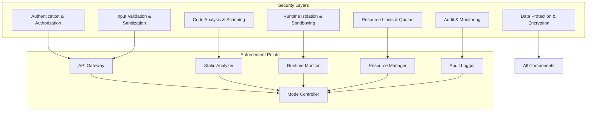

# Apex Platform - Security Model

## Overview

The Apex Platform implements a comprehensive, multi-layered security model that adapts to operational modes while maintaining strong isolation guarantees. This document details the security architecture, policies, and enforcement mechanisms.

## Security Architecture

### Defense in Depth



## Authentication & Authorization

### Authentication System

```elixir
defmodule Apex.Security.Authentication do
  @moduledoc """
  Multi-factor authentication system with pluggable providers.
  """
  
  @type auth_method :: :api_key | :jwt | :oauth2 | :mtls | :session
  @type auth_level :: :none | :basic | :strong | :mfa
  
  @type credentials :: %{
    method: auth_method(),
    token: String.t(),
    metadata: map()
  }
  
  @type identity :: %{
    id: String.t(),
    type: :user | :service | :system,
    roles: [role()],
    permissions: [permission()],
    attributes: map()
  }
  
  @spec authenticate(credentials()) :: {:ok, identity()} | {:error, reason()}
  def authenticate(%{method: :api_key, token: token}) do
    with {:ok, key_data} <- validate_api_key(token),
         {:ok, identity} <- load_identity(key_data.owner_id),
         :ok <- check_key_restrictions(key_data, identity) do
      
      {:ok, add_auth_context(identity, :api_key)}
    end
  end
  
  def authenticate(%{method: :jwt, token: token}) do
    with {:ok, claims} <- verify_jwt(token),
         {:ok, identity} <- extract_identity(claims),
         :ok <- validate_token_lifetime(claims) do
      
      {:ok, add_auth_context(identity, :jwt)}
    end
  end
  
  @spec require_mfa(identity()) :: {:ok, identity()} | {:challenge, mfa_challenge()}
  def require_mfa(identity) do
    if mfa_required?(identity) and not mfa_verified?(identity) do
      {:challenge, create_mfa_challenge(identity)}
    else
      {:ok, identity}
    end
  end
  
  defp mfa_required?(%{type: :user, roles: roles}) do
    Enum.any?(roles, &(&1 in [:admin, :developer]))
  end
  defp mfa_required?(_), do: false
end
```

### Authorization System

```elixir
defmodule Apex.Security.Authorization do
  @moduledoc """
  Role-based access control with fine-grained permissions.
  """
  
  @type role :: atom()
  @type permission :: atom() | {atom(), atom()}
  @type resource :: {type :: atom(), id :: String.t()}
  @type action :: atom()
  
  @type policy :: %{
    effect: :allow | :deny,
    principals: [principal_matcher()],
    actions: [action_matcher()],
    resources: [resource_matcher()],
    conditions: [condition()]
  }
  
  # Role definitions
  @roles %{
    admin: %{
      permissions: [:all],
      inherits: []
    },
    developer: %{
      permissions: [
        :sandbox_create,
        :sandbox_manage_own,
        :debug_own,
        :profile_read,
        :experiment_create
      ],
      inherits: [:viewer]
    },
    tester: %{
      permissions: [
        :sandbox_execute,
        :debug_read,
        :profile_read
      ],
      inherits: [:viewer]
    },
    viewer: %{
      permissions: [
        :sandbox_list,
        :metrics_read,
        :logs_read
      ],
      inherits: []
    }
  }
  
  @spec authorize(identity(), action(), resource()) :: :ok | {:error, :forbidden}
  def authorize(identity, action, resource) do
    policies = load_applicable_policies(identity, action, resource)
    
    decision = evaluate_policies(policies, %{
      principal: identity,
      action: action,
      resource: resource,
      context: build_context()
    })
    
    case decision do
      :allow -> 
        audit_authorization_success(identity, action, resource)
        :ok
        
      :deny -> 
        audit_authorization_failure(identity, action, resource)
        {:error, :forbidden}
    end
  end
  
  @spec check_sandbox_permission(identity(), sandbox_id(), permission()) :: boolean()
  def check_sandbox_permission(identity, sandbox_id, permission) do
    cond do
      has_role?(identity, :admin) -> true
      owns_sandbox?(identity, sandbox_id) -> permission in [:manage, :delete, :debug]
      has_sandbox_access?(identity, sandbox_id) -> permission in [:execute, :read]
      true -> false
    end
  end
end
```

## Code Security

### Static Analysis

```elixir
defmodule Apex.Security.StaticAnalyzer do
  @moduledoc """
  AST-based static analysis for security vulnerabilities.
  """
  
  @type vulnerability :: %{
    type: vulnerability_type(),
    severity: :low | :medium | :high | :critical,
    location: {file :: String.t(), line :: pos_integer()},
    description: String.t(),
    recommendation: String.t()
  }
  
  @type vulnerability_type :: 
    :code_injection |
    :path_traversal |
    :information_disclosure |
    :resource_exhaustion |
    :privilege_escalation |
    :unsafe_operation
  
  @spec analyze_code(String.t(), keyword()) :: {:ok, [vulnerability()]} | {:error, term()}
  def analyze_code(source_code, opts \\ []) do
    with {:ok, ast} <- Code.string_to_quoted(source_code, opts),
         vulnerabilities <- run_analyzers(ast, opts) do
      
      filtered = filter_by_severity(vulnerabilities, opts[:min_severity] || :low)
      {:ok, filtered}
    end
  end
  
  defp run_analyzers(ast, opts) do
    analyzers = [
      &analyze_dangerous_functions/2,
      &analyze_dynamic_code/2,
      &analyze_file_operations/2,
      &analyze_network_operations/2,
      &analyze_process_operations/2,
      &analyze_atom_creation/2
    ]
    
    Enum.flat_map(analyzers, & &1.(ast, opts))
  end
  
  defp analyze_dangerous_functions(ast, _opts) do
    dangerous_calls = [
      {{:., _, [{:__aliases__, _, [:System]}, :cmd]}, _, _},
      {{:., _, [{:__aliases__, _, [:Code]}, :eval_string]}, _, _},
      {{:., _, [{:__aliases__, _, [:File]}, :eval]}, _, _},
      {{:., _, [:erlang, :open_port]}, _, _},
      {{:., _, [:os, :cmd]}, _, _}
    ]
    
    Macro.prewalk(ast, [], fn
      node, vulns ->
        if Enum.any?(dangerous_calls, &match?(&1, node)) do
          vuln = %{
            type: :unsafe_operation,
            severity: :critical,
            location: extract_location(node),
            description: "Dangerous function call detected",
            recommendation: "Use safe alternatives or sandbox this operation"
          }
          {node, [vuln | vulns]}
        else
          {node, vulns}
        end
    end)
    |> elem(1)
  end
  
  defp analyze_atom_creation(ast, _opts) do
    Macro.prewalk(ast, [], fn
      {:binary_to_atom, _, _} = node, vulns ->
        vuln = %{
          type: :resource_exhaustion,
          severity: :high,
          location: extract_location(node),
          description: "Dynamic atom creation can exhaust atom table",
          recommendation: "Use binary_to_existing_atom/2 instead"
        }
        {node, [vuln | vulns]}
        
      node, vulns ->
        {node, vulns}
    end)
    |> elem(1)
  end
end
```

### Security Policies

```elixir
defmodule Apex.Security.Policies do
  @moduledoc """
  Security policy definitions and enforcement.
  """
  
  @type security_profile :: :strict | :standard | :relaxed
  @type policy_rule :: %{
    id: String.t(),
    description: String.t(),
    check: function(),
    enforcement: :block | :warn | :audit
  }
  
  @profiles %{
    strict: %{
      forbidden_modules: ~w(System File Port Code Application)a,
      forbidden_functions: [
        {:erlang, :halt, :any},
        {:init, :stop, :any},
        {:Node, :connect, :any}
      ],
      resource_limits: %{
        max_processes: 100,
        max_memory: 50_000_000,
        max_execution_time: 30_000
      },
      network_access: false,
      file_access: false
    },
    
    standard: %{
      forbidden_modules: ~w(System Port)a,
      forbidden_functions: [
        {:erlang, :halt, :any},
        {:System, :cmd, :any}
      ],
      resource_limits: %{
        max_processes: 1_000,
        max_memory: 100_000_000,
        max_execution_time: 300_000
      },
      network_access: :restricted,
      file_access: :read_only
    },
    
    relaxed: %{
      forbidden_modules: [],
      forbidden_functions: [
        {:erlang, :halt, :any}
      ],
      resource_limits: %{
        max_processes: 10_000,
        max_memory: 500_000_000,
        max_execution_time: :unlimited
      },
      network_access: true,
      file_access: true
    }
  }
  
  @spec get_profile(security_profile() | map()) :: map()
  def get_profile(profile) when is_atom(profile) do
    @profiles[profile] || @profiles[:standard]
  end
  def get_profile(custom) when is_map(custom) do
    Map.merge(@profiles[:standard], custom)
  end
  
  @spec enforce_policy(policy :: map(), code :: String.t()) :: :ok | {:error, violations()}
  def enforce_policy(policy, code) do
    with {:ok, ast} <- Code.string_to_quoted(code),
         :ok <- check_forbidden_modules(ast, policy.forbidden_modules),
         :ok <- check_forbidden_functions(ast, policy.forbidden_functions),
         :ok <- check_resource_usage(ast, policy.resource_limits) do
      :ok
    end
  end
end
```

## Runtime Security

### Process Isolation

```elixir
defmodule Apex.Security.ProcessIsolation do
  @moduledoc """
  Runtime process isolation and monitoring.
  """
  
  @type isolation_config :: %{
    level: :none | :partial | :full,
    restrictions: [restriction()],
    monitors: [monitor_type()],
    limits: resource_limits()
  }
  
  @type restriction :: 
    :no_native_code |
    :no_nif_loading |
    :no_port_creation |
    :no_process_linking |
    :no_code_loading
  
  @spec create_isolated_process(fun(), isolation_config()) :: {:ok, pid()} | {:error, term()}
  def create_isolated_process(fun, config) do
    parent = self()
    
    {:ok, spawn_monitor(fn ->
      try do
        # Apply isolation
        apply_isolation(config)
        
        # Set resource limits
        apply_resource_limits(config.limits)
        
        # Install monitors
        install_monitors(config.monitors)
        
        # Execute function
        result = fun.()
        send(parent, {:result, self(), result})
      catch
        kind, reason ->
          send(parent, {:error, self(), {kind, reason, __STACKTRACE__}})
      end
    end)}
  end
  
  defp apply_isolation(%{level: :full, restrictions: restrictions}) do
    # Disable dangerous operations
    if :no_native_code in restrictions do
      :erlang.process_flag(:trap_exit, true)
      # Block NIF loading by overriding code path
    end
    
    if :no_port_creation in restrictions do
      # Install port creation filter
    end
    
    # Remove sensitive process dictionary entries
    Process.delete(:code_path)
    Process.delete(:current_module)
    
    # Set process as isolated
    Process.put(:"$apex_isolated", true)
  end
  
  defp apply_resource_limits(limits) do
    if max_heap = limits[:max_heap_size] do
      :erlang.process_flag(:max_heap_size, %{
        size: max_heap,
        kill: true,
        error_logger: true
      })
    end
    
    if max_time = limits[:max_execution_time] do
      Process.send_after(self(), :execution_timeout, max_time)
    end
  end
end
```

### Runtime Monitoring

```elixir
defmodule Apex.Security.RuntimeMonitor do
  @moduledoc """
  Real-time security monitoring and anomaly detection.
  """
  
  use GenServer
  
  @type monitor_config :: %{
    sandbox_id: String.t(),
    monitors: [monitor_type()],
    thresholds: map(),
    actions: map()
  }
  
  @type security_event :: %{
    type: event_type(),
    severity: severity(),
    sandbox_id: String.t(),
    timestamp: DateTime.t(),
    details: map()
  }
  
  @type event_type ::
    :suspicious_activity |
    :resource_violation |
    :forbidden_operation |
    :anomalous_behavior |
    :security_bypass_attempt
  
  def start_monitoring(sandbox_id, config) do
    GenServer.start_link(__MODULE__, Map.put(config, :sandbox_id, sandbox_id))
  end
  
  def init(config) do
    # Start monitoring
    schedule_checks()
    
    state = %{
      config: config,
      metrics: %{},
      events: [],
      baseline: establish_baseline()
    }
    
    {:ok, state}
  end
  
  def handle_info(:security_check, state) do
    # Collect metrics
    metrics = collect_security_metrics(state.config.sandbox_id)
    
    # Detect anomalies
    anomalies = detect_anomalies(metrics, state.baseline)
    
    # Check for violations
    violations = check_violations(metrics, state.config.thresholds)
    
    # Take actions
    events = handle_security_events(anomalies ++ violations, state.config.actions)
    
    # Update state
    new_state = %{state | 
      metrics: metrics,
      events: events ++ state.events
    }
    
    # Schedule next check
    schedule_checks()
    
    {:noreply, new_state}
  end
  
  defp detect_anomalies(metrics, baseline) do
    anomalies = []
    
    # Check for unusual process spawning
    if metrics.process_spawn_rate > baseline.avg_spawn_rate * 10 do
      anomalies ++ [%{
        type: :anomalous_behavior,
        severity: :medium,
        details: %{
          metric: :process_spawn_rate,
          current: metrics.process_spawn_rate,
          baseline: baseline.avg_spawn_rate
        }
      }]
    end
    
    # Check for memory spikes
    if metrics.memory_usage > baseline.avg_memory * 5 do
      anomalies ++ [%{
        type: :resource_violation,
        severity: :high,
        details: %{
          metric: :memory_usage,
          current: metrics.memory_usage,
          baseline: baseline.avg_memory
        }
      }]
    end
    
    anomalies
  end
end
```

## Data Protection

### Encryption

```elixir
defmodule Apex.Security.Encryption do
  @moduledoc """
  Data encryption for sensitive information.
  """
  
  @type encryption_config :: %{
    algorithm: :aes_256_gcm | :chacha20_poly1305,
    key_derivation: :pbkdf2 | :argon2,
    key_rotation_interval: pos_integer()
  }
  
  @spec encrypt_sensitive(term(), encryption_config()) :: {:ok, encrypted()} | {:error, term()}
  def encrypt_sensitive(data, config) do
    with {:ok, key} <- get_current_key(config),
         {:ok, serialized} <- serialize(data),
         {:ok, encrypted} <- do_encrypt(serialized, key, config.algorithm) do
      
      {:ok, %{
        ciphertext: encrypted.ciphertext,
        nonce: encrypted.nonce,
        tag: encrypted.tag,
        key_version: key.version,
        algorithm: config.algorithm
      }}
    end
  end
  
  @spec decrypt_sensitive(encrypted(), encryption_config()) :: {:ok, term()} | {:error, term()}
  def decrypt_sensitive(encrypted, config) do
    with {:ok, key} <- get_key_version(encrypted.key_version),
         {:ok, decrypted} <- do_decrypt(encrypted, key),
         {:ok, deserialized} <- deserialize(decrypted) do
      
      {:ok, deserialized}
    end
  end
  
  # Automatic encryption for sensitive fields
  defmacro encrypt_fields(fields) do
    quote do
      @encrypted_fields unquote(fields)
      
      def encrypt_struct(%__MODULE__{} = struct) do
        Enum.reduce(@encrypted_fields, struct, fn field, acc ->
          if value = Map.get(acc, field) do
            case Apex.Security.Encryption.encrypt_sensitive(value, encryption_config()) do
              {:ok, encrypted} -> Map.put(acc, field, encrypted)
              _ -> acc
            end
          else
            acc
          end
        end)
      end
    end
  end
end
```

### Data Masking

```elixir
defmodule Apex.Security.DataMasking do
  @moduledoc """
  Data masking for sensitive information in logs and debug output.
  """
  
  @type masking_rule :: %{
    pattern: Regex.t() | function(),
    replacement: String.t() | function(),
    fields: [atom()]
  }
  
  @default_rules [
    %{
      pattern: ~r/\b[A-Za-z0-9._%+-]+@[A-Za-z0-9.-]+\.[A-Z|a-z]{2,}\b/,
      replacement: "[EMAIL]",
      fields: [:email, :user_email, :contact_email]
    },
    %{
      pattern: ~r/\b(?:\d[ -]*?){13,16}\b/,
      replacement: "[CREDIT_CARD]",
      fields: [:card_number, :credit_card]
    },
    %{
      pattern: ~r/\b\d{3}-\d{2}-\d{4}\b/,
      replacement: "[SSN]",
      fields: [:ssn, :social_security_number]
    }
  ]
  
  @spec mask_data(term(), [masking_rule()]) :: term()
  def mask_data(data, rules \\ @default_rules) when is_map(data) do
    Enum.reduce(rules, data, fn rule, acc ->
      apply_masking_rule(acc, rule)
    end)
  end
  
  def mask_data(data, rules) when is_list(data) do
    Enum.map(data, &mask_data(&1, rules))
  end
  
  def mask_data(data, rules) when is_binary(data) do
    Enum.reduce(rules, data, fn rule, acc ->
      if rule.pattern do
        Regex.replace(rule.pattern, acc, rule.replacement)
      else
        acc
      end
    end)
  end
  
  def mask_data(data, _rules), do: data
end
```

## Audit & Compliance

### Audit Logging

```elixir
defmodule Apex.Security.AuditLogger do
  @moduledoc """
  Comprehensive audit logging for security and compliance.
  """
  
  use GenServer
  
  @type audit_event :: %{
    id: String.t(),
    timestamp: DateTime.t(),
    type: audit_type(),
    actor: actor(),
    action: String.t(),
    resource: String.t(),
    result: :success | :failure,
    details: map(),
    risk_score: float()
  }
  
  @type audit_type :: 
    :authentication |
    :authorization |
    :data_access |
    :configuration_change |
    :security_violation |
    :sandbox_operation
  
  @spec log_event(audit_type(), map()) :: :ok
  def log_event(type, details) do
    event = build_audit_event(type, details)
    GenServer.cast(__MODULE__, {:log, event})
  end
  
  def init(_) do
    # Open audit log file
    {:ok, log} = open_audit_log()
    
    # Start retention timer
    schedule_retention_check()
    
    {:ok, %{
      log: log,
      buffer: [],
      stats: %{}
    }}
  end
  
  def handle_cast({:log, event}, state) do
    # Add to buffer
    new_buffer = [event | state.buffer]
    
    # Flush if buffer is full
    new_state = if length(new_buffer) >= 100 do
      flush_buffer(%{state | buffer: new_buffer})
    else
      %{state | buffer: new_buffer}
    end
    
    # Update statistics
    new_stats = update_stats(new_state.stats, event)
    
    # Check for security alerts
    check_security_alerts(event)
    
    {:noreply, %{new_state | stats: new_stats}}
  end
  
  defp build_audit_event(type, details) do
    %{
      id: UUID.uuid4(),
      timestamp: DateTime.utc_now(),
      type: type,
      actor: get_current_actor(),
      action: details[:action],
      resource: details[:resource],
      result: details[:result] || :success,
      details: mask_sensitive_details(details),
      risk_score: calculate_risk_score(type, details)
    }
  end
  
  defp check_security_alerts(event) do
    cond do
      event.type == :security_violation ->
        send_security_alert(:high, event)
        
      event.risk_score > 0.8 ->
        send_security_alert(:medium, event)
        
      suspicious_pattern?(event) ->
        send_security_alert(:low, event)
        
      true ->
        :ok
    end
  end
end
```

### Compliance Framework

```elixir
defmodule Apex.Security.Compliance do
  @moduledoc """
  Compliance framework for various standards (SOC2, GDPR, HIPAA).
  """
  
  @type compliance_standard :: :soc2 | :gdpr | :hipaa | :pci_dss
  @type compliance_control :: %{
    id: String.t(),
    standard: compliance_standard(),
    description: String.t(),
    implementation: function(),
    evidence: function()
  }
  
  @controls [
    %{
      id: "SOC2-CC6.1",
      standard: :soc2,
      description: "Logical and physical access controls",
      implementation: &implement_access_controls/0,
      evidence: &collect_access_control_evidence/0
    },
    %{
      id: "GDPR-32",
      standard: :gdpr,
      description: "Security of processing",
      implementation: &implement_data_security/0,
      evidence: &collect_data_security_evidence/0
    }
  ]
  
  @spec audit_compliance(compliance_standard()) :: compliance_report()
  def audit_compliance(standard) do
    controls = Enum.filter(@controls, & &1.standard == standard)
    
    results = Enum.map(controls, fn control ->
      %{
        control_id: control.id,
        description: control.description,
        status: evaluate_control(control),
        evidence: control.evidence.(),
        gaps: identify_gaps(control)
      }
    end)
    
    %{
      standard: standard,
      audit_date: DateTime.utc_now(),
      controls: results,
      overall_score: calculate_compliance_score(results)
    }
  end
  
  @spec enforce_compliance(sandbox_config(), [compliance_standard()]) :: sandbox_config()
  def enforce_compliance(config, standards) do
    Enum.reduce(standards, config, fn standard, acc ->
      apply_compliance_requirements(acc, standard)
    end)
  end
  
  defp apply_compliance_requirements(config, :gdpr) do
    config
    |> enable_data_encryption()
    |> enable_audit_logging()
    |> enable_data_retention_policies()
    |> enable_right_to_deletion()
  end
  
  defp apply_compliance_requirements(config, :hipaa) do
    config
    |> enforce_access_controls()
    |> enable_data_encryption()
    |> enable_audit_logging()
    |> enable_data_backup()
  end
end
```

## Security Integration

### Mode-Specific Security

```elixir
defmodule Apex.Security.ModeIntegration do
  @moduledoc """
  Security configuration for different operational modes.
  """
  
  def security_config(:isolation) do
    %{
      authentication: :required,
      authorization: :strict,
      code_scanning: :mandatory,
      runtime_monitoring: :full,
      audit_logging: :comprehensive,
      data_encryption: :all_sensitive_fields,
      compliance: [:soc2, :gdpr]
    }
  end
  
  def security_config(:development) do
    %{
      authentication: :optional,
      authorization: :relaxed,
      code_scanning: :advisory,
      runtime_monitoring: :minimal,
      audit_logging: :errors_only,
      data_encryption: :optional,
      compliance: []
    }
  end
  
  def security_config(:hybrid) do
    %{
      authentication: :required,
      authorization: :role_based,
      code_scanning: :configurable,
      runtime_monitoring: :selective,
      audit_logging: :security_events,
      data_encryption: :configurable,
      compliance: :configurable
    }
  end
end
```

## Next Steps

1. See [Development Tools](07_development_tools.md) for security debugging
2. Follow [Implementation Guide](08_implementation_guide.md) for security setup
3. Check [Performance Guide](09_performance_guide.md) for security overhead
4. Review [Troubleshooting](10_troubleshooting.md) for security issues