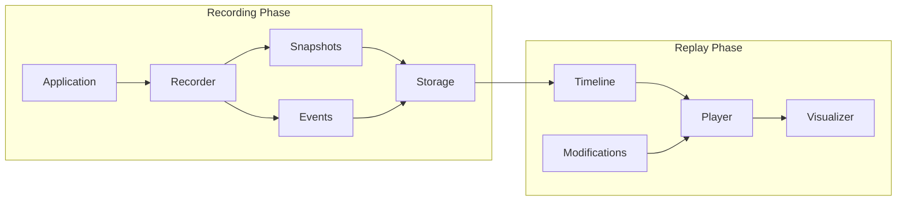

# Apex Platform - Development Tools

## Overview

The Apex Platform provides a comprehensive suite of development tools designed to accelerate debugging, profiling, and experimentation. These tools are primarily available in development and hybrid modes, with controlled access based on permissions.

## Time-Travel Debugging

### Architecture



### Recording System

```elixir
defmodule Apex.DevTools.TimeTravel.Recorder do
  @moduledoc """
  Records application execution for time-travel debugging.
  """
  
  use GenServer
  
  @type recording_config :: %{
    scope: :all | :process | {:processes, [pid()]} | {:modules, [module()]},
    detail_level: :minimal | :standard | :comprehensive,
    compression: :none | :lz4 | :zstd,
    max_duration: pos_integer() | :unlimited,
    max_size: pos_integer() | :unlimited
  }
  
  @type recording :: %{
    id: String.t(),
    started_at: DateTime.t(),
    config: recording_config(),
    snapshots: [snapshot()],
    events: [event()],
    metadata: map()
  }
  
  @spec start_recording(recording_config()) :: {:ok, recording_id()} | {:error, term()}
  def start_recording(config \\ %{}) do
    config = Map.merge(default_config(), config)
    GenServer.start_link(__MODULE__, config, name: via_tuple(config.id))
  end
  
  @spec capture_snapshot(recording_id()) :: {:ok, snapshot_id()} | {:error, term()}
  def capture_snapshot(recording_id) do
    GenServer.call(via_tuple(recording_id), :capture_snapshot)
  end
  
  def init(config) do
    # Start event collection
    :ok = install_trace_patterns(config.scope)
    
    # Schedule periodic snapshots
    schedule_snapshot(config.snapshot_interval)
    
    state = %{
      id: generate_id(),
      config: config,
      snapshots: [],
      events: :queue.new(),
      start_time: System.monotonic_time(:microsecond),
      size: 0
    }
    
    {:ok, state}
  end
  
  def handle_info({:trace, pid, :call, {mod, fun, args}}, state) do
    event = %{
      type: :call,
      timestamp: relative_timestamp(state.start_time),
      pid: pid,
      module: mod,
      function: fun,
      args: safe_capture_args(args, state.config.detail_level)
    }
    
    {:noreply, add_event(state, event)}
  end
  
  def handle_info({:trace, pid, :return_from, {mod, fun, arity}, result}, state) do
    event = %{
      type: :return,
      timestamp: relative_timestamp(state.start_time),
      pid: pid,
      module: mod,
      function: fun,
      arity: arity,
      result: safe_capture_result(result, state.config.detail_level)
    }
    
    {:noreply, add_event(state, event)}
  end
  
  defp add_event(state, event) do
    # Check size limits
    event_size = :erlang.external_size(event)
    
    if state.size + event_size > state.config.max_size do
      # Rotate or stop recording
      handle_size_limit(state)
    else
      %{state | 
        events: :queue.in(event, state.events),
        size: state.size + event_size
      }
    end
  end
end
```

### Replay Engine

```elixir
defmodule Apex.DevTools.TimeTravel.Player do
  @moduledoc """
  Replays recorded execution with ability to modify state.
  """
  
  @type replay_config :: %{
    speed: float(),  # 0.1x to 10x
    breakpoints: [breakpoint()],
    modifications: %{timestamp() => modification()},
    mode: :faithful | :exploratory
  }
  
  @type modification :: %{
    type: :state_change | :input_change | :code_change,
    target: pid() | module(),
    change: term()
  }
  
  @spec replay(recording_id(), replay_config()) :: {:ok, replay_session()} | {:error, term()}
  def replay(recording_id, config \\ %{}) do
    with {:ok, recording} <- load_recording(recording_id),
         {:ok, session} <- create_replay_session(recording, config) do
      
      start_replay(session)
    end
  end
  
  @spec step_forward(session_id(), steps :: pos_integer()) :: {:ok, state()} | {:error, term()}
  def step_forward(session_id, steps \\ 1) do
    GenServer.call(session_id, {:step_forward, steps})
  end
  
  @spec step_to_event(session_id(), event_matcher()) :: {:ok, state()} | {:error, term()}
  def step_to_event(session_id, matcher) do
    GenServer.call(session_id, {:step_to_event, matcher})
  end
  
  @spec modify_and_continue(session_id(), modification()) :: {:ok, divergence_info()} | {:error, term()}
  def modify_and_continue(session_id, modification) do
    GenServer.call(session_id, {:modify_and_continue, modification})
  end
  
  defp create_replay_session(recording, config) do
    # Restore initial state from first snapshot
    {:ok, initial_state} = restore_snapshot(hd(recording.snapshots))
    
    session = %{
      id: generate_id(),
      recording: recording,
      config: config,
      current_position: 0,
      current_state: initial_state,
      modifications: %{},
      divergence_points: []
    }
    
    {:ok, session}
  end
  
  def handle_call({:step_forward, steps}, _from, session) do
    new_position = min(
      session.current_position + steps,
      length(session.recording.events)
    )
    
    # Apply events from current position to new position
    events_to_apply = Enum.slice(
      session.recording.events,
      session.current_position,
      new_position - session.current_position
    )
    
    new_state = Enum.reduce(events_to_apply, session.current_state, fn event, state ->
      apply_event(event, state, session.modifications)
    end)
    
    updated_session = %{session | 
      current_position: new_position,
      current_state: new_state
    }
    
    {:reply, {:ok, new_state}, updated_session}
  end
end
```

### Interactive Debugging Interface

```elixir
defmodule Apex.DevTools.TimeTravel.Interactive do
  @moduledoc """
  Interactive time-travel debugging interface.
  """
  
  defstruct [
    :session,
    :timeline,
    :watches,
    :breakpoints,
    :ui_state
  ]
  
  @spec start_interactive(recording_id()) :: {:ok, pid()} | {:error, term()}
  def start_interactive(recording_id) do
    with {:ok, recording} <- load_recording(recording_id),
         {:ok, session} <- create_session(recording) do
      
      # Start UI
      {:ok, _} = Apex.DevTools.UI.TimeTravel.start_link(session)
      
      {:ok, session}
    end
  end
  
  # Interactive commands
  
  def watch_expression(session, expression) do
    compiled = compile_expression(expression)
    watch = %{
      id: generate_id(),
      expression: expression,
      compiled: compiled,
      history: []
    }
    
    update_watches(session, watch)
  end
  
  def set_breakpoint(session, event_pattern, condition \\ nil) do
    breakpoint = %{
      id: generate_id(),
      pattern: compile_pattern(event_pattern),
      condition: compile_condition(condition),
      hits: 0
    }
    
    update_breakpoints(session, breakpoint)
  end
  
  def find_divergence(session, from_point, to_point) do
    # Compare execution paths between original and modified
    original_path = get_events(session.recording, from_point, to_point)
    modified_path = get_events(session.modified_recording, from_point, to_point)
    
    divergence_analysis = %{
      first_divergence: find_first_difference(original_path, modified_path),
      affected_processes: find_affected_processes(original_path, modified_path),
      state_differences: compare_states(original_path, modified_path),
      impact_assessment: assess_impact(original_path, modified_path)
    }
    
    {:ok, divergence_analysis}
  end
end
```

## Live State Manipulation

### State Inspector

```elixir
defmodule Apex.DevTools.StateInspector do
  @moduledoc """
  Inspects and modifies running application state.
  """
  
  @type inspection_opts :: [
    depth: pos_integer() | :infinity,
    timeout: timeout(),
    sanitize: boolean(),
    include_private: boolean()
  ]
  
  @spec inspect_process(pid(), inspection_opts()) :: {:ok, process_info()} | {:error, term()}
  def inspect_process(pid, opts \\ []) when is_pid(pid) do
    timeout = Keyword.get(opts, :timeout, 5000)
    
    try do
      info = %{
        state: get_process_state(pid, opts),
        message_queue: inspect_message_queue(pid),
        dictionary: inspect_process_dictionary(pid, opts),
        links: Process.info(pid, :links),
        monitors: Process.info(pid, :monitors),
        memory: Process.info(pid, :memory),
        reductions: Process.info(pid, :reductions)
      }
      
      {:ok, info}
    catch
      :exit, reason -> {:error, {:process_dead, reason}}
    end
  end
  
  @spec inspect_ets_table(table :: atom() | reference()) :: {:ok, table_info()} | {:error, term()}
  def inspect_ets_table(table) do
    case :ets.info(table) do
      :undefined -> 
        {:error, :table_not_found}
        
      info ->
        table_data = %{
          info: Enum.into(info, %{}),
          size: :ets.info(table, :size),
          memory: :ets.info(table, :memory),
          sample_data: sample_table_data(table, 10),
          stats: calculate_table_stats(table)
        }
        
        {:ok, table_data}
    end
  end
  
  @spec find_process_by_name(name :: atom()) :: {:ok, pid()} | {:error, :not_found}
  def find_process_by_name(name) do
    case Process.whereis(name) do
      nil -> {:error, :not_found}
      pid -> {:ok, pid}
    end
  end
  
  defp get_process_state(pid, opts) do
    case :sys.get_state(pid, Keyword.get(opts, :timeout, 5000)) do
      state ->
        if Keyword.get(opts, :sanitize, true) do
          sanitize_state(state, opts)
        else
          state
        end
    end
  end
  
  defp sanitize_state(state, opts) do
    max_depth = Keyword.get(opts, :depth, 5)
    include_private = Keyword.get(opts, :include_private, false)
    
    Apex.DevTools.StateSanitizer.sanitize(state,
      max_depth: max_depth,
      include_private: include_private,
      redact_sensitive: true
    )
  end
end
```

### State Manipulator

```elixir
defmodule Apex.DevTools.StateManipulator do
  @moduledoc """
  Safely modifies running process state.
  """
  
  @type manipulation :: %{
    target: pid() | atom(),
    operation: operation(),
    safety_level: :unsafe | :safe | :verified
  }
  
  @type operation ::
    {:set_field, path :: list(), value :: term()} |
    {:update_field, path :: list(), fun :: function()} |
    {:delete_field, path :: list()} |
    {:apply_function, fun :: function()}
  
  @spec manipulate_state(pid(), operation(), opts :: keyword()) :: 
    {:ok, %{old: term(), new: term()}} | {:error, term()}
  def manipulate_state(pid, operation, opts \\ []) do
    safety_level = Keyword.get(opts, :safety_level, :safe)
    
    with :ok <- check_permission(pid, operation, safety_level),
         {:ok, current_state} <- get_current_state(pid),
         {:ok, new_state} <- apply_operation(current_state, operation),
         :ok <- validate_new_state(new_state, pid, safety_level),
         {:ok, backup} <- create_backup(pid, current_state),
         :ok <- set_new_state(pid, new_state) do
      
      {:ok, %{
        old: current_state,
        new: new_state,
        backup_id: backup.id
      }}
    else
      error -> 
        handle_manipulation_error(error, pid)
    end
  end
  
  @spec inject_message(pid(), message :: term(), position :: :first | :last) :: :ok | {:error, term()}
  def inject_message(pid, message, position \\ :last) do
    case position do
      :first ->
        # Requires special handling to prepend
        inject_at_head(pid, message)
        
      :last ->
        send(pid, message)
        :ok
    end
  end
  
  @spec rollback_state(pid(), backup_id :: String.t()) :: :ok | {:error, term()}
  def rollback_state(pid, backup_id) do
    with {:ok, backup} <- load_backup(backup_id),
         :ok <- verify_backup_compatibility(backup, pid),
         :ok <- set_new_state(pid, backup.state) do
      
      Logger.info("State rolled back for process #{inspect(pid)}")
      :ok
    end
  end
  
  defp apply_operation(state, {:set_field, path, value}) do
    try do
      new_state = put_in(state, path, value)
      {:ok, new_state}
    rescue
      _ -> {:error, :invalid_path}
    end
  end
  
  defp apply_operation(state, {:update_field, path, fun}) do
    try do
      new_state = update_in(state, path, fun)
      {:ok, new_state}
    rescue
      _ -> {:error, :invalid_path}
    end
  end
  
  defp apply_operation(state, {:apply_function, fun}) when is_function(fun, 1) do
    try do
      new_state = fun.(state)
      {:ok, new_state}
    rescue
      error -> {:error, {:function_error, error}}
    end
  end
  
  defp set_new_state(pid, new_state) do
    try do
      :sys.replace_state(pid, fn _ -> new_state end)
      :ok
    catch
      :exit, reason -> {:error, {:replace_state_failed, reason}}
    end
  end
end
```

## Code Experimentation

### Experiment Manager

```elixir
defmodule Apex.DevTools.Experimentation do
  @moduledoc """
  Manages code experiments and A/B testing.
  """
  
  use GenServer
  
  @type experiment :: %{
    id: String.t(),
    name: String.t(),
    description: String.t(),
    base_module: module(),
    variants: %{variant_name() => variant()},
    metrics: [metric()],
    status: :draft | :running | :completed,
    results: map()
  }
  
  @type variant :: %{
    name: String.t(),
    code: String.t(),
    compiled: term() | nil,
    metrics: map(),
    metadata: map()
  }
  
  @type metric :: %{
    name: String.t(),
    type: :counter | :gauge | :histogram | :summary,
    calculator: function()
  }
  
  @spec create_experiment(String.t(), module(), keyword()) :: {:ok, experiment_id()} | {:error, term()}
  def create_experiment(name, base_module, opts \\ []) do
    GenServer.call(__MODULE__, {:create_experiment, name, base_module, opts})
  end
  
  @spec add_variant(experiment_id(), String.t(), String.t()) :: :ok | {:error, term()}
  def add_variant(experiment_id, variant_name, code) do
    GenServer.call(__MODULE__, {:add_variant, experiment_id, variant_name, code})
  end
  
  @spec run_experiment(experiment_id(), test_data :: term(), opts :: keyword()) :: 
    {:ok, results()} | {:error, term()}
  def run_experiment(experiment_id, test_data, opts \\ []) do
    GenServer.call(__MODULE__, {:run_experiment, experiment_id, test_data, opts}, :infinity)
  end
  
  def handle_call({:create_experiment, name, base_module, opts}, _from, state) do
    experiment = %{
      id: generate_id(),
      name: name,
      description: Keyword.get(opts, :description, ""),
      base_module: base_module,
      variants: %{
        control: create_control_variant(base_module)
      },
      metrics: create_default_metrics(opts),
      status: :draft,
      results: %{}
    }
    
    new_state = Map.put(state.experiments, experiment.id, experiment)
    {:reply, {:ok, experiment.id}, %{state | experiments: new_state}}
  end
  
  def handle_call({:run_experiment, experiment_id, test_data, opts}, _from, state) do
    case Map.get(state.experiments, experiment_id) do
      nil ->
        {:reply, {:error, :not_found}, state}
        
      experiment ->
        results = run_all_variants(experiment, test_data, opts)
        analysis = analyze_results(results, experiment.metrics)
        
        updated_experiment = %{experiment | 
          status: :completed,
          results: results
        }
        
        new_state = put_in(state.experiments[experiment_id], updated_experiment)
        
        {:reply, {:ok, analysis}, new_state}
    end
  end
  
  defp run_all_variants(experiment, test_data, opts) do
    iterations = Keyword.get(opts, :iterations, 100)
    parallel = Keyword.get(opts, :parallel, true)
    
    runner = if parallel do
      &run_variant_parallel/4
    else
      &run_variant_sequential/4
    end
    
    Enum.into(experiment.variants, %{}, fn {name, variant} ->
      metrics = runner.(variant, test_data, iterations, experiment.metrics)
      {name, metrics}
    end)
  end
  
  defp run_variant_parallel(variant, test_data, iterations, metric_defs) do
    tasks = for _ <- 1..iterations do
      Task.async(fn ->
        run_single_iteration(variant, test_data, metric_defs)
      end)
    end
    
    results = Task.await_many(tasks, 30_000)
    aggregate_metrics(results)
  end
end
```

### A/B Testing Framework

```elixir
defmodule Apex.DevTools.ABTesting do
  @moduledoc """
  A/B testing framework for gradual rollout and comparison.
  """
  
  @type ab_test :: %{
    id: String.t(),
    name: String.t(),
    variants: %{
      control: variant_config(),
      treatment: variant_config()
    },
    split: split_config(),
    metrics: [metric_config()],
    status: :active | :paused | :completed
  }
  
  @type split_config :: %{
    type: :percentage | :user_based | :feature_flag,
    control_percentage: 0..100,
    sticky: boolean()
  }
  
  @spec create_ab_test(String.t(), control :: term(), treatment :: term(), opts :: keyword()) ::
    {:ok, ab_test_id()} | {:error, term()}
  def create_ab_test(name, control, treatment, opts \\ []) do
    test = %{
      id: generate_id(),
      name: name,
      variants: %{
        control: configure_variant(control, :control),
        treatment: configure_variant(treatment, :treatment)
      },
      split: configure_split(opts),
      metrics: configure_metrics(opts),
      status: :active
    }
    
    {:ok, _} = start_ab_test_server(test)
    {:ok, test.id}
  end
  
  @spec route_request(ab_test_id(), context :: map()) :: {:ok, :control | :treatment} | {:error, term()}
  def route_request(test_id, context) do
    GenServer.call(via_tuple(test_id), {:route_request, context})
  end
  
  @spec get_results(ab_test_id()) :: {:ok, ab_results()} | {:error, term()}
  def get_results(test_id) do
    GenServer.call(via_tuple(test_id), :get_results)
  end
  
  defp start_ab_test_server(test) do
    GenServer.start_link(__MODULE__, test, name: via_tuple(test.id))
  end
  
  def handle_call({:route_request, context}, _from, state) do
    variant = determine_variant(context, state.split, state.assignments)
    
    # Record assignment
    new_assignments = if state.split.sticky do
      Map.put(state.assignments, context.user_id, variant)
    else
      state.assignments
    end
    
    # Update metrics
    new_metrics = update_routing_metrics(state.metrics, variant)
    
    new_state = %{state | 
      assignments: new_assignments,
      metrics: new_metrics
    }
    
    {:reply, {:ok, variant}, new_state}
  end
  
  def handle_call(:get_results, _from, state) do
    results = %{
      control: calculate_variant_metrics(state.metrics.control),
      treatment: calculate_variant_metrics(state.metrics.treatment),
      statistical_significance: calculate_significance(state.metrics),
      recommendation: make_recommendation(state.metrics)
    }
    
    {:reply, {:ok, results}, state}
  end
end
```

## Performance Profiling

### CPU Profiler

```elixir
defmodule Apex.DevTools.Profiler.CPU do
  @moduledoc """
  CPU profiling with minimal overhead.
  """
  
  @type profile_config :: %{
    type: :sampling | :tracing,
    sample_rate: pos_integer(),  # Hz for sampling
    modules: [module()] | :all,
    duration: pos_integer() | :manual,
    include_native: boolean()
  }
  
  @spec start_profiling(profile_config()) :: {:ok, session_id()} | {:error, term()}
  def start_profiling(config \\ %{}) do
    config = Map.merge(default_config(), config)
    
    profiler = case config.type do
      :sampling -> start_sampling_profiler(config)
      :tracing -> start_tracing_profiler(config)
    end
    
    {:ok, profiler}
  end
  
  defp start_sampling_profiler(config) do
    {:ok, profiler} = :eprof.start()
    
    # Configure profiler
    :eprof.start_profiling(
      get_target_processes(config),
      get_target_modules(config)
    )
    
    if config.duration != :manual do
      schedule_stop(profiler, config.duration)
    end
    
    %{
      id: generate_id(),
      type: :sampling,
      profiler: profiler,
      config: config,
      started_at: DateTime.utc_now()
    }
  end
  
  defp start_tracing_profiler(config) do
    {:ok, _} = :fprof.start()
    
    trace_opts = [
      {:procs, get_target_processes(config)},
      {:sort, :own}  # Sort by own time by default
    ]
    
    :fprof.trace([:start | trace_opts])
    
    %{
      id: generate_id(),
      type: :tracing,
      config: config,
      started_at: DateTime.utc_now()
    }
  end
  
  @spec analyze_profile(session_id()) :: {:ok, analysis()} | {:error, term()}
  def analyze_profile(session) do
    case session.type do
      :sampling -> analyze_sampling_profile(session)
      :tracing -> analyze_tracing_profile(session)
    end
  end
  
  defp analyze_sampling_profile(session) do
    :eprof.stop_profiling()
    analysis = :eprof.analyze(:total)
    
    # Convert to structured format
    result = parse_eprof_analysis(analysis)
    
    # Add flamegraph data
    flamegraph_data = generate_flamegraph(result)
    
    {:ok, %{
      type: :sampling,
      duration: DateTime.diff(DateTime.utc_now(), session.started_at),
      top_functions: get_top_functions(result, 20),
      modules_summary: summarize_by_module(result),
      flamegraph: flamegraph_data,
      recommendations: generate_cpu_recommendations(result)
    }}
  end
end
```

### Memory Profiler

```elixir
defmodule Apex.DevTools.Profiler.Memory do
  @moduledoc """
  Memory profiling and leak detection.
  """
  
  @type memory_profile_config :: %{
    interval: pos_integer(),  # milliseconds
    include_binaries: boolean(),
    track_allocations: boolean(),
    gc_before_sample: boolean()
  }
  
  @spec start_memory_profiling(memory_profile_config()) :: {:ok, session_id()} | {:error, term()}
  def start_memory_profiling(config \\ %{}) do
    config = Map.merge(default_memory_config(), config)
    
    {:ok, collector} = GenServer.start_link(__MODULE__, config)
    
    {:ok, %{
      id: generate_id(),
      collector: collector,
      config: config
    }}
  end
  
  def init(config) do
    # Schedule first sample
    schedule_sample(config.interval)
    
    state = %{
      config: config,
      samples: [],
      baseline: take_memory_snapshot(config),
      start_time: System.monotonic_time(:millisecond)
    }
    
    {:ok, state}
  end
  
  def handle_info(:sample, state) do
    # Optional GC before sampling
    if state.config.gc_before_sample do
      :erlang.garbage_collect()
    end
    
    sample = take_memory_snapshot(state.config)
    
    new_state = %{state | samples: [sample | state.samples]}
    
    # Check for potential leaks
    check_memory_leaks(new_state)
    
    # Schedule next sample
    schedule_sample(state.config.interval)
    
    {:noreply, new_state}
  end
  
  defp take_memory_snapshot(config) do
    %{
      timestamp: System.monotonic_time(:millisecond),
      total: :erlang.memory(:total),
      processes: :erlang.memory(:processes),
      binary: :erlang.memory(:binary),
      ets: :erlang.memory(:ets),
      atom: :erlang.memory(:atom),
      process_details: if(config.track_allocations, do: get_process_memory_details(), else: nil),
      binary_refs: if(config.include_binaries, do: get_binary_references(), else: nil)
    }
  end
  
  defp get_process_memory_details do
    Process.list()
    |> Enum.map(fn pid ->
      case Process.info(pid, [:memory, :binary, :total_heap_size, :heap_size]) do
        nil -> nil
        info -> {pid, Map.new(info)}
      end
    end)
    |> Enum.reject(&is_nil/1)
    |> Enum.sort_by(fn {_pid, info} -> info.memory end, :desc)
    |> Enum.take(100)  # Top 100 processes by memory
  end
  
  @spec analyze_memory_profile(session_id()) :: {:ok, memory_analysis()} | {:error, term()}
  def analyze_memory_profile(session) do
    samples = get_samples(session)
    
    analysis = %{
      duration: calculate_duration(samples),
      memory_growth: analyze_memory_growth(samples),
      leak_candidates: detect_leak_candidates(samples),
      process_analysis: analyze_process_memory(samples),
      binary_analysis: analyze_binary_memory(samples),
      recommendations: generate_memory_recommendations(samples)
    }
    
    {:ok, analysis}
  end
  
  defp detect_leak_candidates(samples) do
    # Look for continuously growing memory
    process_growth = analyze_process_growth(samples)
    binary_growth = analyze_binary_growth(samples)
    
    candidates = []
    
    # Processes with continuous growth
    candidates = candidates ++ Enum.filter(process_growth, fn {_pid, growth_rate} ->
      growth_rate > 0.1  # 10% growth per sample
    end)
    
    # Large binaries not being garbage collected
    candidates = candidates ++ find_leaked_binaries(samples)
    
    candidates
  end
end
```

## Debugging Interface

### Web Dashboard

```elixir
defmodule Apex.DevTools.UI.Dashboard do
  @moduledoc """
  Main development dashboard interface.
  """
  
  use Phoenix.LiveView
  
  @impl true
  def mount(_params, _session, socket) do
    if connected?(socket) do
      # Subscribe to updates
      Apex.DevTools.subscribe()
      
      # Start periodic updates
      :timer.send_interval(1000, self(), :update_metrics)
    end
    
    socket = 
      socket
      |> assign(:sandboxes, list_sandboxes())
      |> assign(:experiments, list_experiments())
      |> assign(:profiles, list_profiles())
      |> assign(:recordings, list_recordings())
      |> assign(:metrics, get_current_metrics())
      |> assign(:selected_tab, :overview)
    
    {:ok, socket}
  end
  
  @impl true
  def render(assigns) do
    ~H"""
    <div class="apex-dashboard">
      <nav class="tabs">
        <a href="#" phx-click="select_tab" phx-value-tab="overview" 
           class={tab_class(@selected_tab, :overview)}>Overview</a>
        <a href="#" phx-click="select_tab" phx-value-tab="debugging"
           class={tab_class(@selected_tab, :debugging)}>Debugging</a>
        <a href="#" phx-click="select_tab" phx-value-tab="profiling"
           class={tab_class(@selected_tab, :profiling)}>Profiling</a>
        <a href="#" phx-click="select_tab" phx-value-tab="experiments"
           class={tab_class(@selected_tab, :experiments)}>Experiments</a>
      </nav>
      
      <div class="tab-content">
        <%= case @selected_tab do %>
          <% :overview -> %>
            <.overview_tab metrics={@metrics} sandboxes={@sandboxes} />
          <% :debugging -> %>
            <.debugging_tab recordings={@recordings} />
          <% :profiling -> %>
            <.profiling_tab profiles={@profiles} />
          <% :experiments -> %>
            <.experiments_tab experiments={@experiments} />
        <% end %>
      </div>
    </div>
    """
  end
  
  defp overview_tab(assigns) do
    ~H"""
    <div class="overview">
      <div class="metrics-grid">
        <div class="metric-card">
          <h3>Active Sandboxes</h3>
          <div class="metric-value"><%= length(@sandboxes) %></div>
        </div>
        <div class="metric-card">
          <h3>CPU Usage</h3>
          <div class="metric-value"><%= @metrics.cpu %>%</div>
        </div>
        <div class="metric-card">
          <h3>Memory Usage</h3>
          <div class="metric-value"><%= format_bytes(@metrics.memory) %></div>
        </div>
        <div class="metric-card">
          <h3>Active Experiments</h3>
          <div class="metric-value"><%= @metrics.active_experiments %></div>
        </div>
      </div>
      
      <div class="sandbox-list">
        <h2>Sandboxes</h2>
        <table>
          <thead>
            <tr>
              <th>ID</th>
              <th>Mode</th>
              <th>Status</th>
              <th>Resources</th>
              <th>Actions</th>
            </tr>
          </thead>
          <tbody>
            <%= for sandbox <- @sandboxes do %>
              <tr>
                <td><%= sandbox.id %></td>
                <td><%= sandbox.mode %></td>
                <td><%= sandbox.status %></td>
                <td><%= format_resources(sandbox.resources) %></td>
                <td>
                  <button phx-click="inspect_sandbox" phx-value-id={sandbox.id}>
                    Inspect
                  </button>
                </td>
              </tr>
            <% end %>
          </tbody>
        </table>
      </div>
    </div>
    """
  end
end
```

### CLI Tools

```elixir
defmodule Apex.DevTools.CLI do
  @moduledoc """
  Command-line interface for development tools.
  """
  
  def main(args) do
    {opts, command, _} = OptionParser.parse(args,
      switches: [
        mode: :string,
        sandbox: :string,
        format: :string,
        output: :string
      ]
    )
    
    case command do
      ["inspect", target] -> inspect_command(target, opts)
      ["profile", type] -> profile_command(type, opts)
      ["experiment", subcommand | rest] -> experiment_command(subcommand, rest, opts)
      ["debug", subcommand | rest] -> debug_command(subcommand, rest, opts)
      _ -> print_help()
    end
  end
  
  defp inspect_command(target, opts) do
    result = case parse_target(target) do
      {:pid, pid} -> Apex.DevTools.StateInspector.inspect_process(pid, opts)
      {:name, name} -> inspect_by_name(name, opts)
      {:ets, table} -> Apex.DevTools.StateInspector.inspect_ets_table(table)
    end
    
    format_and_output(result, opts)
  end
  
  defp profile_command("cpu", opts) do
    IO.puts("Starting CPU profiling...")
    {:ok, session} = Apex.DevTools.Profiler.CPU.start_profiling(
      duration: get_duration(opts),
      type: get_profile_type(opts)
    )
    
    IO.puts("Profiling... Press Enter to stop")
    IO.gets("")
    
    {:ok, analysis} = Apex.DevTools.Profiler.CPU.stop_and_analyze(session)
    format_and_output(analysis, opts)
  end
  
  defp profile_command("memory", opts) do
    IO.puts("Starting memory profiling...")
    {:ok, session} = Apex.DevTools.Profiler.Memory.start_memory_profiling(
      interval: get_interval(opts),
      duration: get_duration(opts)
    )
    
    wait_for_completion(session)
    
    {:ok, analysis} = Apex.DevTools.Profiler.Memory.analyze_memory_profile(session)
    format_and_output(analysis, opts)
  end
end
```

## Integration with Development Workflow

### VS Code Extension

```typescript
// Apex Platform VS Code Extension
import * as vscode from 'vscode';
import { ApexClient } from './client';

export function activate(context: vscode.ExtensionContext) {
    const client = new ApexClient();
    
    // Register commands
    context.subscriptions.push(
        vscode.commands.registerCommand('apex.inspectProcess', inspectProcess),
        vscode.commands.registerCommand('apex.startProfiling', startProfiling),
        vscode.commands.registerCommand('apex.timeTravel', timeTravel),
        vscode.commands.registerCommand('apex.runExperiment', runExperiment)
    );
    
    // Register code lens provider
    context.subscriptions.push(
        vscode.languages.registerCodeLensProvider(
            { language: 'elixir' },
            new ApexCodeLensProvider(client)
        )
    );
}

class ApexCodeLensProvider implements vscode.CodeLensProvider {
    constructor(private client: ApexClient) {}
    
    provideCodeLenses(document: vscode.TextDocument): vscode.CodeLens[] {
        const lenses: vscode.CodeLens[] = [];
        
        // Add lens for GenServers
        const genServerRegex = /use\s+GenServer/g;
        let match;
        while (match = genServerRegex.exec(document.getText())) {
            const line = document.positionAt(match.index).line;
            const range = new vscode.Range(line, 0, line, 0);
            
            lenses.push(
                new vscode.CodeLens(range, {
                    title: "🔍 Inspect State",
                    command: "apex.inspectProcess",
                    arguments: [document.uri, line]
                }),
                new vscode.CodeLens(range, {
                    title: "📊 Profile",
                    command: "apex.startProfiling",
                    arguments: [document.uri, line]
                })
            );
        }
        
        return lenses;
    }
}
```

## Next Steps

1. Follow [Implementation Guide](08_implementation_guide.md) for setup
2. Check [Performance Guide](09_performance_guide.md) for optimization
3. Review [Troubleshooting](10_troubleshooting.md) for common issues
4. See [API Reference](11_api_reference.md) for detailed documentation