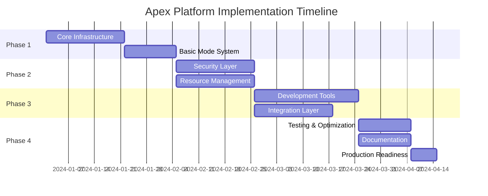

# Apex Platform - Implementation Guide

## Overview

This guide provides step-by-step instructions for implementing the Apex Platform, from initial setup through production deployment. The implementation is divided into phases to allow for incremental development and testing.

## Implementation Phases

### Phase Overview



## Phase 1: Core Infrastructure (Weeks 1-5)

### Week 1-3: Project Setup and Core Components

#### 1.1 Create Project Structure

```bash
# Create new project
mix new apex --sup
cd apex

# Create directory structure
mkdir -p lib/apex/{core,modes,security,dev_tools,integrations}
mkdir -p test/apex/{core,modes,security,dev_tools,integrations}
mkdir -p priv/{static,templates}
mkdir -p docs/{api,guides,specs}
```

#### 1.2 Update mix.exs

```elixir
defmodule Apex.MixProject do
  use Mix.Project

  @version "2.0.0"
  @source_url "https://github.com/apex/platform"

  def project do
    [
      app: :apex,
      version: @version,
      elixir: "~> 1.14",
      elixirc_paths: elixirc_paths(Mix.env()),
      start_permanent: Mix.env() == :prod,
      aliases: aliases(),
      deps: deps(),
      
      # Hex
      description: "Unified platform for secure code execution and development tools",
      package: package(),
      
      # Docs
      name: "Apex Platform",
      source_url: @source_url,
      homepage_url: @source_url,
      docs: docs(),
      
      # Dialyzer
      dialyzer: [
        plt_add_apps: [:erts, :kernel, :stdlib],
        flags: [:error_handling, :race_conditions, :unmatched_returns]
      ],
      
      # Test coverage
      test_coverage: [tool: ExCoveralls],
      preferred_cli_env: [
        coveralls: :test,
        "coveralls.detail": :test,
        "coveralls.post": :test,
        "coveralls.html": :test
      ]
    ]
  end

  def application do
    [
      mod: {Apex.Application, []},
      extra_applications: [:logger, :runtime_tools, :crypto, :observer]
    ]
  end

  defp elixirc_paths(:test), do: ["lib", "test/support"]
  defp elixirc_paths(_), do: ["lib"]

  defp deps do
    [
      # Core dependencies
      {:telemetry, "~> 1.2"},
      {:telemetry_metrics, "~> 0.6"},
      {:telemetry_poller, "~> 1.0"},
      {:jason, "~> 1.4"},
      {:nimble_parsec, "~> 1.3"},
      
      # Optional integrations
      {:phoenix, "~> 1.7", optional: true},
      {:phoenix_live_view, "~> 0.20", optional: true},
      {:ecto, "~> 3.11", optional: true},
      
      # Development and test
      {:ex_doc, "~> 0.31", only: :dev, runtime: false},
      {:dialyxir, "~> 1.4", only: [:dev, :test], runtime: false},
      {:credo, "~> 1.7", only: [:dev, :test], runtime: false},
      {:sobelow, "~> 0.13", only: [:dev, :test], runtime: false},
      {:stream_data, "~> 0.6", only: :test},
      {:mox, "~> 1.1", only: :test},
      {:excoveralls, "~> 0.18", only: :test}
    ]
  end

  defp aliases do
    [
      setup: ["deps.get", "compile"],
      test: ["test --warnings-as-errors"],
      "test.all": ["test --include integration"],
      quality: ["format", "credo --strict", "dialyzer", "sobelow"],
      "quality.ci": ["format --check-formatted", "credo --strict", "dialyzer", "sobelow"]
    ]
  end

  defp package do
    [
      maintainers: ["Apex Team"],
      licenses: ["Apache-2.0"],
      links: %{"GitHub" => @source_url},
      files: ~w(lib priv .formatter.exs mix.exs README.md LICENSE CHANGELOG.md)
    ]
  end

  defp docs do
    [
      main: "readme",
      extras: ["README.md", "CHANGELOG.md"] ++ Path.wildcard("docs/guides/*.md"),
      groups_for_extras: [
        "Guides": Path.wildcard("docs/guides/*.md")
      ],
      groups_for_modules: [
        "Core": [Apex.Core],
        "Modes": [Apex.Modes],
        "Security": [Apex.Security],
        "Development Tools": [Apex.DevTools],
        "Integrations": [Apex.Phoenix, Apex.Ecto]
      ]
    ]
  end
end
```

#### 1.3 Implement Core Application

```elixir
# lib/apex/application.ex
defmodule Apex.Application do
  @moduledoc false
  use Application

  @impl true
  def start(_type, _args) do
    children = [
      # Core components
      {Registry, keys: :unique, name: Apex.Registry},
      {DynamicSupervisor, strategy: :one_for_one, name: Apex.DynamicSupervisor},
      
      # Core services
      Apex.Core.EventBus,
      Apex.Core.Storage.Supervisor,
      Apex.Core.ModuleManager,
      Apex.Core.StateManager,
      Apex.Core.ProcessManager,
      Apex.Core.ResourceManager,
      
      # Mode controller
      Apex.ModeController,
      
      # Telemetry
      Apex.Telemetry
    ]

    # Add environment-specific children
    children = children ++ env_children()

    opts = [strategy: :one_for_one, name: Apex.Supervisor]
    Supervisor.start_link(children, opts)
  end

  defp env_children do
    case Application.get_env(:apex, :env_children, []) do
      children when is_list(children) -> children
      {mod, fun, args} -> apply(mod, fun, args)
      _ -> []
    end
  end
end
```

#### 1.4 Implement Core Components

```elixir
# lib/apex/core/module_manager.ex
defmodule Apex.Core.ModuleManager do
  use GenServer
  require Logger

  # ... (implementation from 03_core_components.md)
  
  def start_link(opts) do
    GenServer.start_link(__MODULE__, opts, name: __MODULE__)
  end
  
  def init(_opts) do
    # Initialize ETS tables for module storage
    :ets.new(:apex_modules, [:named_table, :public, :set, 
                            read_concurrency: true, write_concurrency: true])
    :ets.new(:apex_module_deps, [:named_table, :public, :bag,
                                 read_concurrency: true])
    
    state = %{
      modules: %{},
      versions: %{},
      dependencies: %{},
      transformers: [],
      mode_config: %{},
      metrics: init_metrics()
    }
    
    {:ok, state}
  end
  
  # ... (rest of implementation)
end
```

### Week 4-5: Basic Mode System

#### 1.5 Implement Mode Controller

```elixir
# lib/apex/mode_controller.ex
defmodule Apex.ModeController do
  use GenServer
  require Logger

  @type mode :: :isolation | :development | :hybrid
  
  defstruct [:current_mode, :config, :features, :permissions]

  def start_link(opts) do
    GenServer.start_link(__MODULE__, opts, name: __MODULE__)
  end

  def init(opts) do
    mode = Keyword.get(opts, :mode, default_mode())
    config = load_mode_config(mode)
    
    state = %__MODULE__{
      current_mode: mode,
      config: config,
      features: resolve_features(mode, config),
      permissions: resolve_permissions(mode, config)
    }
    
    # Broadcast mode initialization
    Apex.Core.EventBus.emit(:mode_initialized, %{mode: mode})
    
    {:ok, state}
  end

  @spec current_mode() :: mode()
  def current_mode do
    GenServer.call(__MODULE__, :current_mode)
  end

  @spec switch_mode(mode(), keyword()) :: :ok | {:error, term()}
  def switch_mode(new_mode, opts \\ []) do
    GenServer.call(__MODULE__, {:switch_mode, new_mode, opts})
  end

  def handle_call(:current_mode, _from, state) do
    {:reply, state.current_mode, state}
  end

  def handle_call({:switch_mode, new_mode, opts}, _from, state) do
    case validate_mode_switch(state.current_mode, new_mode) do
      :ok ->
        new_config = load_mode_config(new_mode)
        new_state = %{state | 
          current_mode: new_mode,
          config: new_config,
          features: resolve_features(new_mode, new_config),
          permissions: resolve_permissions(new_mode, new_config)
        }
        
        # Apply mode changes to all components
        apply_mode_changes(state.current_mode, new_mode)
        
        {:reply, :ok, new_state}
        
      error ->
        {:reply, error, state}
    end
  end

  defp default_mode do
    Application.get_env(:apex, :default_mode, :hybrid)
  end

  defp load_mode_config(:isolation), do: Apex.Modes.Isolation.config()
  defp load_mode_config(:development), do: Apex.Modes.Development.config()
  defp load_mode_config(:hybrid), do: Apex.Modes.Hybrid.config()
end
```

## Phase 2: Security and Resources (Weeks 6-8)

### Week 6: Security Layer

#### 2.1 Implement Security Components

```elixir
# lib/apex/security/authenticator.ex
defmodule Apex.Security.Authenticator do
  @moduledoc """
  Handles authentication for the Apex platform.
  """
  
  @behaviour Apex.Security.AuthBehaviour
  
  @impl true
  def authenticate(credentials) do
    case credentials do
      %{method: :api_key, token: token} ->
        authenticate_api_key(token)
        
      %{method: :jwt, token: token} ->
        authenticate_jwt(token)
        
      _ ->
        {:error, :unsupported_auth_method}
    end
  end
  
  defp authenticate_api_key(token) do
    # In production, this would check against a database
    case lookup_api_key(token) do
      {:ok, key_data} ->
        identity = build_identity(key_data)
        {:ok, identity}
        
      :error ->
        {:error, :invalid_api_key}
    end
  end
  
  defp authenticate_jwt(token) do
    case Apex.Security.JWT.verify_and_decode(token) do
      {:ok, claims} ->
        identity = build_identity_from_claims(claims)
        {:ok, identity}
        
      {:error, reason} ->
        {:error, {:jwt_error, reason}}
    end
  end
end
```

#### 2.2 Implement Static Analyzer

```elixir
# lib/apex/security/static_analyzer.ex
defmodule Apex.Security.StaticAnalyzer do
  @moduledoc """
  AST-based static analysis for security vulnerabilities.
  """
  
  def analyze_code(source_code, opts \\ []) do
    with {:ok, ast} <- Code.string_to_quoted(source_code, opts) do
      vulnerabilities = run_all_analyzers(ast, opts)
      {:ok, vulnerabilities}
    end
  end
  
  defp run_all_analyzers(ast, opts) do
    analyzers = [
      Apex.Security.Analyzers.DangerousFunctions,
      Apex.Security.Analyzers.DynamicCode,
      Apex.Security.Analyzers.FileOperations,
      Apex.Security.Analyzers.NetworkOperations,
      Apex.Security.Analyzers.AtomExhaustion
    ]
    
    Enum.flat_map(analyzers, & &1.analyze(ast, opts))
  end
end
```

### Week 7-8: Resource Management

#### 2.3 Implement Resource Manager

```elixir
# lib/apex/core/resource_manager.ex
defmodule Apex.Core.ResourceManager do
  use GenServer
  require Logger

  defstruct [
    :allocations,
    :global_limits,
    :mode_defaults,
    :policies,
    :monitors
  ]

  def start_link(opts) do
    GenServer.start_link(__MODULE__, opts, name: __MODULE__)
  end

  def init(_opts) do
    # Initialize resource tracking
    :ets.new(:apex_resources, [:named_table, :public, :set,
                               read_concurrency: true])
    
    state = %__MODULE__{
      allocations: %{},
      global_limits: load_global_limits(),
      mode_defaults: load_mode_defaults(),
      policies: load_resource_policies(),
      monitors: %{}
    }
    
    # Start resource monitoring
    schedule_resource_check()
    
    {:ok, state}
  end

  def allocate(sandbox_id, requested, opts \\ []) do
    GenServer.call(__MODULE__, {:allocate, sandbox_id, requested, opts})
  end

  def handle_call({:allocate, sandbox_id, requested, opts}, _from, state) do
    mode = Keyword.get(opts, :mode, :hybrid)
    defaults = Map.get(state.mode_defaults, mode, %{})
    
    # Merge requested with defaults
    resources = Map.merge(defaults, requested)
    
    # Check if allocation is possible
    case check_availability(resources, state.allocations) do
      :ok ->
        allocation = create_allocation(sandbox_id, resources)
        new_allocations = Map.put(state.allocations, sandbox_id, allocation)
        
        # Start monitoring
        {:ok, monitor} = start_resource_monitor(sandbox_id, allocation)
        new_monitors = Map.put(state.monitors, sandbox_id, monitor)
        
        new_state = %{state | 
          allocations: new_allocations,
          monitors: new_monitors
        }
        
        {:reply, {:ok, allocation}, new_state}
        
      {:error, reason} ->
        {:reply, {:error, reason}, state}
    end
  end

  def handle_info(:check_resources, state) do
    # Check all allocations for violations
    Enum.each(state.allocations, fn {sandbox_id, allocation} ->
      check_resource_usage(sandbox_id, allocation)
    end)
    
    # Schedule next check
    schedule_resource_check()
    
    {:noreply, state}
  end

  defp check_resource_usage(sandbox_id, allocation) do
    current = get_current_usage(sandbox_id)
    
    Enum.each(allocation.limits, fn {resource, limit} ->
      usage = Map.get(current, resource, 0)
      
      if exceeds_limit?(usage, limit) do
        handle_limit_violation(sandbox_id, resource, usage, limit)
      end
    end)
  end
end
```

## Phase 3: Development Tools and Integration (Weeks 9-12)

### Week 9-10: Development Tools

#### 3.1 Implement Time-Travel Debugging

```elixir
# lib/apex/dev_tools/time_travel.ex
defmodule Apex.DevTools.TimeTravel do
  @moduledoc """
  Time-travel debugging implementation.
  """
  
  defmodule Recorder do
    use GenServer
    
    def start_recording(opts \\ []) do
      GenServer.start_link(__MODULE__, opts)
    end
    
    def init(opts) do
      # Install trace patterns
      install_traces(opts[:scope] || :all)
      
      state = %{
        recording_id: generate_id(),
        events: [],
        snapshots: [],
        config: opts,
        started_at: System.monotonic_time(:microsecond)
      }
      
      {:ok, state}
    end
    
    defp install_traces(:all) do
      # Trace all function calls
      :erlang.trace_pattern({:_, :_, :_}, true, [:local])
      :erlang.trace(:all, true, [:call, :return_to, :procs, :garbage_collection])
    end
    
    defp install_traces({:modules, modules}) do
      Enum.each(modules, fn module ->
        :erlang.trace_pattern({module, :_, :_}, true, [:local])
      end)
      :erlang.trace(:all, true, [:call, :return_to])
    end
  end
end
```

#### 3.2 Implement State Inspector

```elixir
# lib/apex/dev_tools/state_inspector.ex
defmodule Apex.DevTools.StateInspector do
  @moduledoc """
  Live state inspection and manipulation.
  """
  
  def inspect_process(pid, opts \\ []) when is_pid(pid) do
    timeout = Keyword.get(opts, :timeout, 5000)
    
    try do
      state = :sys.get_state(pid, timeout)
      
      info = %{
        state: sanitize_state(state, opts),
        message_queue: get_message_queue_info(pid),
        memory: Process.info(pid, :memory),
        reductions: Process.info(pid, :reductions),
        current_function: Process.info(pid, :current_function)
      }
      
      {:ok, info}
    catch
      :exit, reason ->
        {:error, {:process_error, reason}}
    end
  end
  
  defp sanitize_state(state, opts) do
    max_depth = Keyword.get(opts, :depth, 5)
    
    Apex.DevTools.Sanitizer.sanitize(state,
      max_depth: max_depth,
      redact_patterns: [
        ~r/password/i,
        ~r/secret/i,
        ~r/token/i
      ]
    )
  end
end
```

### Week 11-12: Framework Integration

#### 3.3 Phoenix Integration

```elixir
# lib/apex/integrations/phoenix.ex
defmodule Apex.Phoenix do
  @moduledoc """
  Phoenix framework integration for Apex.
  """
  
  defmacro __using__(opts) do
    quote do
      @apex_opts unquote(opts)
      
      # Add Apex-specific plugs
      plug Apex.Phoenix.Plugs.ModeDetector
      plug Apex.Phoenix.Plugs.SecurityHeaders
      
      if Application.get_env(:apex, :dev_ui_enabled, true) do
        plug Apex.Phoenix.Plugs.DevUI
      end
    end
  end
  
  def child_spec(opts) do
    %{
      id: __MODULE__,
      start: {__MODULE__, :start_link, [opts]},
      type: :supervisor
    }
  end
  
  def start_link(opts) do
    children = [
      {Apex.Phoenix.Socket, []},
      {Apex.Phoenix.Telemetry, []},
      {Apex.Phoenix.DevServer, opts}
    ]
    
    Supervisor.start_link(children, strategy: :one_for_one)
  end
end
```

## Phase 4: Testing and Production (Weeks 13-14)

### Week 13: Comprehensive Testing

#### 4.1 Test Infrastructure

```elixir
# test/support/apex_case.ex
defmodule Apex.Test.Case do
  @moduledoc """
  Base test case for Apex tests.
  """
  
  use ExUnit.CaseTemplate
  
  using do
    quote do
      import Apex.Test.Helpers
      import Apex.Test.Assertions
      
      setup :create_test_sandbox
    end
  end
  
  setup tags do
    mode = tags[:mode] || :hybrid
    
    {:ok, _} = start_supervised({Apex.TestSupervisor, mode: mode})
    
    on_exit(fn ->
      Apex.Test.Cleanup.cleanup_all()
    end)
    
    {:ok, mode: mode}
  end
end
```

#### 4.2 Integration Tests

```elixir
# test/apex/integration_test.exs
defmodule Apex.IntegrationTest do
  use Apex.Test.Case
  
  @moduletag :integration
  
  describe "mode transitions" do
    test "can transition from isolation to hybrid" do
      # Start in isolation mode
      {:ok, sandbox} = Apex.create("test", TestModule, mode: :isolation)
      
      # Verify isolation
      assert {:error, _} = Apex.execute(sandbox, :dangerous_operation, [])
      
      # Transition to hybrid
      :ok = Apex.transition_mode(sandbox, :hybrid)
      
      # Verify hybrid allows with permission
      :ok = Apex.grant_permission(sandbox, :dangerous_operations)
      assert {:ok, _} = Apex.execute(sandbox, :dangerous_operation, [])
    end
  end
  
  describe "resource management" do
    test "enforces memory limits in isolation mode" do
      {:ok, sandbox} = Apex.create("memory_test", TestModule,
        mode: :isolation,
        resources: %{memory: 10_000_000}  # 10MB
      )
      
      # This should fail due to memory limit
      assert {:error, :resource_limit_exceeded} = 
        Apex.execute(sandbox, :allocate_large_binary, [20_000_000])
    end
  end
end
```

### Week 14: Production Readiness

#### 4.3 Performance Optimization

```elixir
# lib/apex/performance/optimizer.ex
defmodule Apex.Performance.Optimizer do
  @moduledoc """
  Performance optimizations for production.
  """
  
  def optimize_for_production do
    # Compile-time optimizations
    if Mix.env() == :prod do
      # Disable development features
      Application.put_env(:apex, :dev_tools_enabled, false)
      Application.put_env(:apex, :debug_mode, false)
      
      # Enable production optimizations
      Application.put_env(:apex, :cache_compiled_modules, true)
      Application.put_env(:apex, :pool_sandbox_processes, true)
    end
  end
  
  def configure_vm_for_production do
    # Set VM flags for production
    :erlang.system_flag(:schedulers_online, :erlang.system_info(:schedulers))
    :erlang.system_flag(:dirty_cpu_schedulers_online, 
                       :erlang.system_info(:dirty_cpu_schedulers))
    
    # Configure garbage collection
    :erlang.system_flag(:max_heap_size, %{
      size: 0,  # No limit by default
      kill: true,
      error_logger: true
    })
  end
end
```

#### 4.4 Deployment Configuration

```elixir
# config/prod.exs
import Config

config :apex,
  default_mode: :isolation,
  security_profile: :strict,
  
  # Production features
  features: [
    authentication: :required,
    audit_logging: :comprehensive,
    resource_monitoring: :enabled
  ],
  
  # Resource limits
  global_limits: %{
    max_sandboxes: 1000,
    max_memory_per_sandbox: 100_000_000,  # 100MB
    max_processes_per_sandbox: 1_000
  },
  
  # Storage configuration
  storage: [
    hot_storage: [
      ttl: 3600,  # 1 hour
      max_size: "1GB"
    ],
    cold_storage: [
      adapter: Apex.Storage.S3,
      bucket: System.get_env("APEX_S3_BUCKET"),
      region: System.get_env("AWS_REGION", "us-east-1")
    ]
  ]

# Configure telemetry
config :apex, Apex.Telemetry,
  reporters: [
    {Apex.Telemetry.StatsD, [
      host: System.get_env("STATSD_HOST", "localhost"),
      port: 8125
    ]}
  ]
```

## Deployment Guide

### Docker Deployment

```dockerfile
# Dockerfile
FROM elixir:1.15-alpine AS build

# Install build dependencies
RUN apk add --no-cache build-base git

# Set build env
ENV MIX_ENV=prod

# Install hex + rebar
RUN mix local.hex --force && \
    mix local.rebar --force

# Set build dir
WORKDIR /app

# Copy mix files
COPY mix.exs mix.lock ./
COPY config config

# Install dependencies
RUN mix deps.get --only prod && \
    mix deps.compile

# Copy source
COPY lib lib
COPY priv priv

# Compile and build release
RUN mix compile
RUN mix release

# Runtime stage
FROM alpine:3.18

RUN apk add --no-cache openssl ncurses-libs libstdc++

WORKDIR /app

# Copy release from build stage
COPY --from=build /app/_build/prod/rel/apex ./

# Set runtime env
ENV HOME=/app
ENV LANG=C.UTF-8

# Expose ports
EXPOSE 4000 4369 9001-9010

CMD ["bin/apex", "start"]
```

### Kubernetes Deployment

```yaml
# k8s/apex-platform.yaml
apiVersion: v1
kind: ConfigMap
metadata:
  name: apex-config
data:
  APEX_MODE: "hybrid"
  APEX_SECURITY_PROFILE: "standard"
  APEX_CLUSTER_ENABLED: "true"
---
apiVersion: apps/v1
kind: Deployment
metadata:
  name: apex-platform
spec:
  replicas: 3
  selector:
    matchLabels:
      app: apex
  template:
    metadata:
      labels:
        app: apex
    spec:
      containers:
      - name: apex
        image: apex/platform:2.0.0
        ports:
        - containerPort: 4000
          name: http
        - containerPort: 4369
          name: epmd
        - containerPort: 9001
          name: dist
        envFrom:
        - configMapRef:
            name: apex-config
        resources:
          requests:
            memory: "512Mi"
            cpu: "500m"
          limits:
            memory: "2Gi"
            cpu: "2000m"
---
apiVersion: v1
kind: Service
metadata:
  name: apex-service
spec:
  selector:
    app: apex
  ports:
  - port: 80
    targetPort: 4000
  type: LoadBalancer
```

## Monitoring Setup

### Prometheus Configuration

```yaml
# prometheus/apex_rules.yml
groups:
  - name: apex_alerts
    rules:
    - alert: HighSandboxCount
      expr: apex_sandboxes_active > 900
      for: 5m
      labels:
        severity: warning
      annotations:
        summary: "High number of active sandboxes"
        
    - alert: HighMemoryUsage
      expr: apex_memory_usage_bytes > 1800000000
      for: 10m
      labels:
        severity: critical
      annotations:
        summary: "Apex platform memory usage critical"
        
    - alert: SecurityViolations
      expr: rate(apex_security_violations_total[5m]) > 10
      for: 1m
      labels:
        severity: critical
      annotations:
        summary: "High rate of security violations detected"
```

## Next Steps

1. Follow [Performance Guide](09_performance_guide.md) for optimization
2. Review [Troubleshooting](10_troubleshooting.md) for common issues
3. Check [Monitoring Guide](11_monitoring_guide.md) for observability
4. See [Migration Guide](12_migration_guide.md) for upgrading