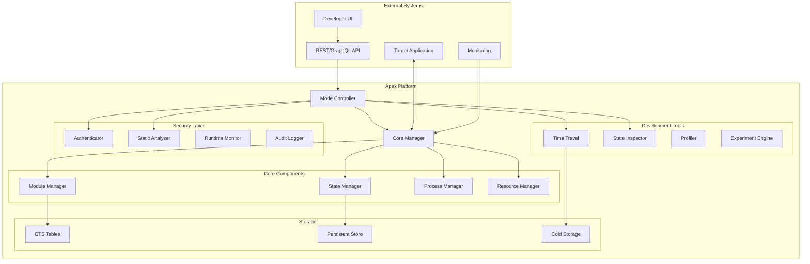

# Design Document

## Overview

The Apex Platform is designed as a unified system that combines secure code isolation with advanced development tools through a mode-based architecture. The platform provides three operational modes (isolation, development, and hybrid) that share a common core infrastructure while enabling mode-specific features and security policies.

## Architecture

### High-Level Architecture



### Core Components

The platform is built on four core components that provide fundamental services across all operational modes:

1. **Module Manager** - Handles module loading, transformation, versioning, and hot-swapping
2. **State Manager** - Manages state synchronization, preservation, and manipulation
3. **Process Manager** - Controls process lifecycle, isolation, and monitoring
4. **Resource Manager** - Enforces resource limits and tracks usage

## Components and Interfaces

### Mode Controller

```elixir
defmodule Apex.ModeController do
  @moduledoc """
  Controls operational mode configuration and feature availability.
  """
  
  @type mode :: :isolation | :development | :hybrid
  @type feature :: atom()
  @type permission :: atom()
  
  @type config :: %{
    mode: mode(),
    features: MapSet.t(feature()),
    permissions: %{permission() => boolean()},
    security_level: :strict | :standard | :relaxed
  }
  
  @spec initialize(mode(), keyword()) :: {:ok, config()} | {:error, term()}
  @spec switch_mode(mode(), keyword()) :: :ok | {:error, term()}
  @spec check_feature(feature()) :: boolean()
  @spec check_permission(permission()) :: boolean()
end
```

### Module Manager Interface

```elixir
defmodule Apex.Core.ModuleManager do
  @moduledoc """
  Unified module management with mode-aware transformation.
  """
  
  @type module_id :: {sandbox_id :: String.t(), module_name :: module()}
  @type version :: String.t()
  
  @type load_opts :: [
    mode: :isolation | :development | :hybrid,
    transform: boolean(),
    namespace: String.t(),
    security_scan: boolean(),
    version: version()
  ]
  
  @spec load_module(String.t(), module(), binary(), load_opts()) :: 
    {:ok, module()} | {:error, term()}
  
  @spec hot_swap(String.t(), module(), binary()) :: 
    :ok | {:error, term()}
  
  @spec get_module_info(String.t(), module()) :: 
    {:ok, module_info()} | {:error, :not_found}
  
  @spec list_modules(String.t()) :: [module_info()]
  
  @spec track_dependency(module(), module()) :: :ok
  
  @spec get_dependencies(module()) :: [module()]
end
```

### State Manager Interface

```elixir
defmodule Apex.Core.StateManager do
  @moduledoc """
  State synchronization and manipulation services.
  """
  
  @type sync_mode :: :push | :pull | :bidirectional
  @type sync_strategy :: :eager | :lazy | {:periodic, pos_integer()} | :manual
  @type state_source :: pid() | atom() | {atom(), node()}
  
  @type bridge_config :: %{
    source: state_source(),
    target: state_source(),
    mode: sync_mode(),
    strategy: sync_strategy(),
    filters: [filter()],
    transformers: [transformer()]
  }
  
  @spec create_bridge(bridge_config()) :: {:ok, bridge_id()} | {:error, term()}
  
  @spec sync_now(bridge_id()) :: {:ok, sync_stats()} | {:error, term()}
  
  @spec capture_snapshot(state_source(), keyword()) :: 
    {:ok, snapshot_id()} | {:error, term()}
  
  @spec restore_snapshot(state_source(), snapshot_id()) :: 
    :ok | {:error, term()}
  
  @spec manipulate_state(pid(), (term() -> term())) :: 
    {:ok, %{old: term(), new: term()}} | {:error, term()}
end
```

### Security Interfaces

```elixir
defmodule Apex.Security do
  @moduledoc """
  Security subsystem interfaces.
  """
  
  defmodule Authenticator do
    @type auth_method :: :api_key | :jwt | :oauth2
    @type credentials :: %{method: auth_method(), token: String.t()}
    @type identity :: %{
      id: String.t(),
      roles: [role()],
      permissions: [permission()]
    }
    
    @callback authenticate(credentials()) :: {:ok, identity()} | {:error, term()}
    @callback require_mfa(identity()) :: {:ok, identity()} | {:challenge, term()}
  end
  
  defmodule StaticAnalyzer do
    @type vulnerability :: %{
      type: atom(),
      severity: :low | :medium | :high | :critical,
      location: {String.t(), pos_integer()},
      description: String.t()
    }
    
    @callback analyze_code(String.t(), keyword()) :: 
      {:ok, [vulnerability()]} | {:error, term()}
  end
end
```

## Data Models

### Sandbox Model

```elixir
defmodule Apex.Models.Sandbox do
  @type t :: %__MODULE__{
    id: String.t(),
    mode: :isolation | :development | :hybrid,
    status: :starting | :running | :stopped | :error,
    module_ids: [module_id()],
    resource_allocation: resource_allocation(),
    security_context: security_context(),
    metadata: map(),
    created_at: DateTime.t(),
    updated_at: DateTime.t()
  }
  
  defstruct [
    :id, :mode, :status, :module_ids, :resource_allocation,
    :security_context, :metadata, :created_at, :updated_at
  ]
end
```

### Recording Model

```elixir
defmodule Apex.Models.Recording do
  @type t :: %__MODULE__{
    id: String.t(),
    sandbox_id: String.t(),
    started_at: DateTime.t(),
    ended_at: DateTime.t() | nil,
    events: [event()],
    snapshots: [snapshot()],
    size_bytes: non_neg_integer(),
    compression: :none | :lz4 | :zstd
  }
  
  defstruct [
    :id, :sandbox_id, :started_at, :ended_at,
    events: [], snapshots: [], size_bytes: 0, compression: :lz4
  ]
end
```

### Resource Allocation Model

```elixir
defmodule Apex.Models.ResourceAllocation do
  @type t :: %__MODULE__{
    memory: limit(),
    cpu: limit(),
    processes: limit(),
    ets_tables: limit(),
    ports: limit(),
    execution_time: limit()
  }
  
  @type limit :: pos_integer() | :unlimited
  
  defstruct [
    memory: :unlimited,
    cpu: :unlimited,
    processes: :unlimited,
    ets_tables: :unlimited,
    ports: :unlimited,
    execution_time: :unlimited
  ]
end
```

## Error Handling

The platform uses a consistent error handling strategy across all components:

```elixir
defmodule Apex.Errors do
  @type error_category :: 
    :authentication | :authorization | :validation | 
    :resource_limit | :security_violation | :mode_conflict |
    :not_found | :already_exists | :timeout
  
  @type error :: {error_category(), term()}
  
  @spec normalize_error(term()) :: error()
  def normalize_error(error) do
    case error do
      {:error, {category, _details}} when is_atom(category) -> error
      {:error, :not_found} -> {:not_found, "Resource not found"}
      {:error, :timeout} -> {:timeout, "Operation timed out"}
      {:error, other} -> {:unknown, other}
      other -> {:unknown, other}
    end
  end
  
  @spec handle_error(error(), keyword()) :: {:ok, term()} | {:error, term()}
  def handle_error({category, details}, opts) do
    case category do
      :resource_limit -> handle_resource_limit(details, opts)
      :security_violation -> handle_security_violation(details, opts)
      :mode_conflict -> handle_mode_conflict(details, opts)
      _ -> {:error, {category, details}}
    end
  end
end
```

## Testing Strategy

The platform testing strategy includes:

1. **Unit Tests** - Test individual components in isolation
2. **Integration Tests** - Test component interactions
3. **Mode Tests** - Test mode-specific behavior
4. **Security Tests** - Test security controls and vulnerability detection
5. **Performance Tests** - Test resource usage and overhead
6. **Property Tests** - Test invariants and edge cases

```elixir
defmodule Apex.TestFramework do
  @moduledoc """
  Testing utilities for Apex platform.
  """
  
  defmacro test_in_mode(mode, description, do: block) do
    quote do
      test unquote(description) do
        original_mode = Apex.ModeController.current_mode()
        
        try do
          Apex.ModeController.switch_mode(unquote(mode))
          unquote(block)
        after
          Apex.ModeController.switch_mode(original_mode)
        end
      end
    end
  end
  
  def with_sandbox(mode, fun) do
    {:ok, sandbox} = Apex.create("test_#{:rand.uniform(1000)}", TestModule, mode: mode)
    
    try do
      fun.(sandbox)
    after
      Apex.destroy(sandbox)
    end
  end
end
```

## Performance Optimization

Performance optimization strategies by mode:

### Isolation Mode
- Module transformation caching
- Process pool reuse
- Batch security scanning
- Resource pre-allocation

### Development Mode
- Lazy feature loading
- Sampling-based profiling
- Incremental state sync
- Smart cache invalidation

### Hybrid Mode
- Permission-based optimization
- Conditional feature loading
- Adaptive resource allocation
- Hybrid caching strategy

## Security Architecture

### Defense in Depth

1. **Authentication Layer** - Multi-factor authentication support
2. **Authorization Layer** - Role-based access control
3. **Static Analysis Layer** - AST-based code scanning
4. **Runtime Security Layer** - Process isolation and monitoring
5. **Audit Layer** - Comprehensive event logging

### Mode-Specific Security

```elixir
defmodule Apex.Security.ModePolicy do
  def policy(:isolation) do
    %{
      code_transformation: :required,
      dangerous_operations: :blocked,
      resource_limits: :enforced,
      audit_level: :comprehensive
    }
  end
  
  def policy(:development) do
    %{
      code_transformation: :disabled,
      dangerous_operations: :warned,
      resource_limits: :monitored,
      audit_level: :minimal
    }
  end
  
  def policy(:hybrid) do
    %{
      code_transformation: :optional,
      dangerous_operations: :permission_based,
      resource_limits: :configurable,
      audit_level: :selective
    }
  end
end
```

## Integration Points

### Phoenix Integration
- Custom plugs for mode detection
- LiveView hooks for state inspection
- Development dashboard routes

### Ecto Integration
- Query profiling middleware
- Migration sandboxing
- Connection pooling

### OTP Integration
- GenServer state inspection
- Supervisor tree visualization
- Process monitoring

## Migration Strategy

### From Apex Sandbox v1.x
1. Update dependencies to Apex Platform 2.0
2. Configure default mode as `:isolation` for compatibility
3. Update any custom module transformers
4. Test security policies
5. Gradually enable new features

### From Other Sandbox Solutions
1. Map existing isolation features to Apex modes
2. Implement compatibility layer if needed
3. Migrate security policies
4. Update integration points
5. Retrain team on new features

## Success Metrics

✅ Support for 3 operational modes with hot-switching  
✅ Less than 1% overhead in development mode  
✅ Less than 10% overhead in isolation mode  
✅ Support for 100+ concurrent sandboxes per node  
✅ Sub-second mode transitions  
✅ Zero-downtime module hot-swapping  
✅ Complete backward compatibility with v1.x APIs