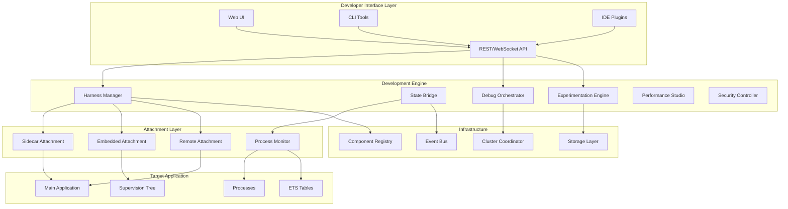
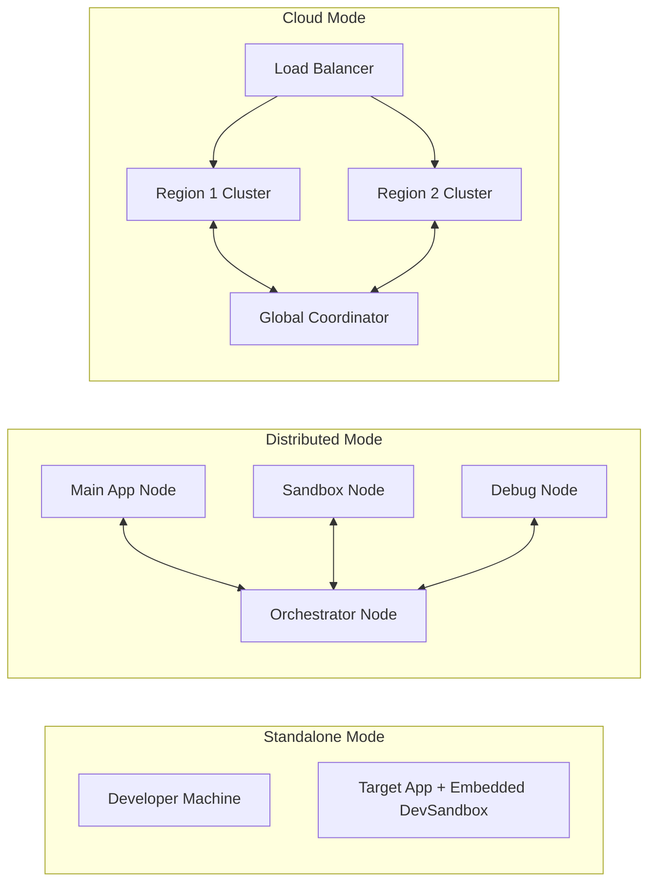

# Development Sandbox Platform Design Document

## Overview

This document provides the technical design for the Development Sandbox Platform, a comprehensive development acceleration system built on top of the Apex Sandbox infrastructure. The platform transforms the secure isolation capabilities into powerful development tools while maintaining safety and performance.

## Architecture

### High-Level Architecture



### Deployment Architectures



## Core Components

### Development Harness

```elixir
defmodule DevSandbox.Harness do
  @moduledoc """
  Provides lightweight, non-invasive attachment to Elixir applications.
  Supports multiple attachment modes with automatic discovery.
  """
  
  use GenServer
  
  @type attachment_mode :: :sidecar | :embedded | :remote
  @type connection_state :: :disconnected | :connecting | :connected | :error
  @type harness_options :: [
    mode: attachment_mode(),
    target_app: atom(),
    node: node() | nil,
    monitors: [monitor_type()],
    config: map()
  ]
  
  @type monitor_type :: :process | :ets | :memory | :messages
  
  @type t :: %__MODULE__{
    id: String.t(),
    target_app: atom(),
    mode: attachment_mode(),
    connection: pid() | nil,
    monitors: [pid()],
    state_bridge: pid() | nil,
    discovery_data: map(),
    status: connection_state(),
    started_at: DateTime.t(),
    config: map()
  }
  
  defstruct [
    :id,
    :target_app,
    :mode,
    :connection,
    :monitors,
    :state_bridge,
    :discovery_data,
    :status,
    :started_at,
    :config
  ]
  
  @spec attach(atom(), harness_options()) :: {:ok, pid()} | {:error, term()}
  def attach(target_app, opts \\ []) do
    DevSandbox.HarnessSupervisor.start_harness(target_app, opts)
  end
  
  @spec discover(pid()) :: {:ok, discovery_data()} | {:error, term()}
  def discover(harness) do
    GenServer.call(harness, :discover, 30_000)
  end
end
```

### State Bridge

```elixir
defmodule DevSandbox.StateBridge do
  @moduledoc """
  Manages bidirectional state synchronization between applications.
  Provides filtering, transformation, and multiple sync strategies.
  """
  
  use GenServer
  
  @type sync_mode :: :pull | :push | :bidirectional
  @type sync_strategy :: :eager | :lazy | {:periodic, pos_integer()} | :on_demand
  @type filter :: (term() -> boolean()) | {module(), atom(), [term()]}
  @type transformer :: (term() -> term()) | {module(), atom(), [term()]}
  
  @type t :: %__MODULE__{
    id: String.t(),
    source: pid() | node(),
    target: pid() | node(),
    mode: sync_mode(),
    strategy: sync_strategy(),
    filters: [filter()],
    transformers: [transformer()],
    buffer: :queue.queue(),
    sync_interval: pos_integer(),
    last_sync: DateTime.t() | nil,
    sync_count: non_neg_integer(),
    error_count: non_neg_integer(),
    subscriptions: %{optional(reference()) => subscription()}
  }
  
  @type subscription :: %{
    pattern: term(),
    callback: function(),
    options: keyword()
  }
  
  defstruct [
    :id,
    :source,
    :target,
    :mode,
    :strategy,
    :filters,
    :transformers,
    :buffer,
    :sync_interval,
    :last_sync,
    sync_count: 0,
    error_count: 0,
    subscriptions: %{}
  ]
end
```

### Time-Travel Debugger

```elixir
defmodule DevSandbox.TimeTravel do
  @moduledoc """
  Provides time-travel debugging with state recording and replay.
  Supports modifications during replay to test hypotheses.
  """
  
  @type recording_id :: String.t()
  @type timestamp :: non_neg_integer()  # microseconds
  
  @type snapshot :: %{
    timestamp: timestamp(),
    processes: %{pid() => process_state()},
    ets_tables: %{reference() => ets_snapshot()},
    memory: memory_snapshot(),
    metadata: map()
  }
  
  @type event :: %{
    timestamp: timestamp(),
    type: event_type(),
    source: pid() | atom(),
    data: term(),
    effects: [effect()]
  }
  
  @type recording :: %__MODULE__.Recording{
    id: recording_id(),
    start_time: timestamp(),
    end_time: timestamp() | nil,
    snapshots: [snapshot()],
    events: [event()],
    compression: compression_type(),
    status: recording_status()
  }
  
  @type replay_options :: [
    speed: float(),
    breakpoints: [replay_breakpoint()],
    modifications: %{timestamp() => modification()},
    collect_divergence: boolean()
  ]
end
```

## Components and Interfaces

### Experimentation Engine Interface

```elixir
defmodule DevSandbox.Experimentation do
  @moduledoc """
  Manages code experiments with isolation and comparison capabilities.
  """
  
  @type experiment_id :: String.t()
  @type variant_name :: atom() | String.t()
  
  @callback create_experiment(name :: String.t(), base_modules :: [module()], opts :: keyword()) :: 
    {:ok, experiment_id()} | {:error, term()}
    
  @callback add_variant(experiment_id(), variant_name(), code :: String.t()) ::
    :ok | {:error, term()}
    
  @callback run_experiment(experiment_id(), test_data :: term(), opts :: keyword()) ::
    {:ok, results()} | {:error, term()}
    
  @callback compare_variants(experiment_id()) ::
    {:ok, comparison()} | {:error, term()}
end
```

### Debug Orchestrator Interface

```elixir
defmodule DevSandbox.Debug do
  @moduledoc """
  Coordinates debugging across distributed nodes.
  """
  
  @type session_id :: String.t()
  @type breakpoint_id :: String.t()
  
  @callback start_session(nodes :: [node()], opts :: keyword()) ::
    {:ok, session_id()} | {:error, term()}
    
  @callback set_breakpoint(session_id(), module(), line :: pos_integer(), condition :: term() | nil) ::
    {:ok, breakpoint_id()} | {:error, term()}
    
  @callback step(session_id(), step_type()) ::
    :ok | {:error, term()}
    
  @callback inspect_variable(session_id(), var_path :: String.t()) ::
    {:ok, value :: term()} | {:error, term()}
end
```

## Data Models

### Harness State Model

```elixir
defmodule DevSandbox.Models.HarnessState do
  @type discovery_data :: %{
    app_info: application_info(),
    supervision_tree: supervision_tree(),
    processes: [process_info()],
    ets_tables: [ets_info()],
    modules: [module()],
    configuration: keyword() | map()
  }
  
  @type application_info :: %{
    name: atom(),
    version: String.t(),
    description: String.t(),
    modules: [module()],
    applications: [atom()],
    mod: {module(), term()} | nil
  }
  
  @type supervision_tree :: %{
    supervisor: pid() | atom(),
    children: [child_info()],
    strategy: supervision_strategy(),
    intensity: non_neg_integer(),
    period: pos_integer()
  }
  
  @type monitor_state :: %{
    type: monitor_type(),
    target: pid() | atom() | reference(),
    metrics: %{atom() => number()},
    status: :active | :paused | :error,
    last_update: DateTime.t()
  }
end
```

### Experiment Model

```elixir
defmodule DevSandbox.Models.Experiment do
  @type t :: %__MODULE__{
    id: String.t(),
    name: String.t(),
    description: String.t() | nil,
    base_context: base_context(),
    variants: %{variant_name() => variant()},
    metrics: [metric_definition()],
    results: %{variant_name() => variant_results()},
    status: experiment_status(),
    created_at: DateTime.t(),
    updated_at: DateTime.t()
  }
  
  @type variant :: %{
    name: String.t(),
    code: String.t(),
    compiled: compiled_code() | nil,
    metadata: map(),
    created_at: DateTime.t()
  }
  
  @type variant_results :: %{
    executions: non_neg_integer(),
    metrics: %{metric_name() => metric_value()},
    errors: [error_info()],
    summary: statistical_summary()
  }
end
```

## Error Handling

### Error Categories and Recovery

```elixir
defmodule DevSandbox.Errors do
  @moduledoc """
  Standardized error handling across the platform.
  """
  
  @type error_category :: 
    :attachment_failed |
    :sync_error |
    :compilation_error |
    :security_violation |
    :resource_exhausted |
    :network_error
    
  @type error_severity :: :low | :medium | :high | :critical
  
  @type error_info :: %{
    category: error_category(),
    severity: error_severity(),
    message: String.t(),
    details: map(),
    timestamp: DateTime.t(),
    recovery_action: recovery_action()
  }
  
  @type recovery_action ::
    :retry |
    :retry_with_backoff |
    :fallback |
    :abort |
    :manual_intervention
    
  @spec handle_error(error_info()) :: {:ok, recovery_result()} | {:error, :unrecoverable}
  def handle_error(%{recovery_action: :retry} = error) do
    # Implement retry logic
  end
  
  @spec categorize_error(Exception.t()) :: error_category()
  def categorize_error(error) do
    # Pattern match on error types
  end
end
```

## Testing Strategy

### Test Categories

1. **Unit Tests**: Component isolation testing
2. **Integration Tests**: Inter-component communication
3. **System Tests**: Full platform functionality
4. **Performance Tests**: Overhead and scalability
5. **Security Tests**: Policy enforcement and isolation

### Test Infrastructure

```elixir
defmodule DevSandbox.TestInfrastructure do
  @moduledoc """
  Provides test utilities and helpers for Development Sandbox testing.
  """
  
  defmacro __using__(opts) do
    quote do
      use ExUnit.Case, unquote(opts)
      import DevSandbox.TestHelpers
      import DevSandbox.TestFactories
      
      setup do
        # Start test supervisor
        {:ok, _} = start_supervised(DevSandbox.TestSupervisor)
        
        # Create test application
        {:ok, app} = DevSandbox.TestApp.start()
        
        on_exit(fn ->
          DevSandbox.TestApp.stop(app)
        end)
        
        %{test_app: app}
      end
    end
  end
end
```

## Performance Optimization

### Optimization Strategies

1. **Lazy Loading**: Components load on-demand
2. **Resource Pooling**: Reuse sandbox instances and connections
3. **Smart Caching**: Cache discovery data and compiled experiments
4. **Async Operations**: Non-blocking by default with timeouts
5. **Batch Processing**: Group similar operations for efficiency

### Performance Metrics

```elixir
defmodule DevSandbox.Metrics do
  @metrics [
    # Latency metrics
    distribution("devsandbox.harness.attachment.duration", unit: :millisecond),
    distribution("devsandbox.sync.duration", unit: :millisecond),
    distribution("devsandbox.experiment.run.duration", unit: :millisecond),
    
    # Throughput metrics
    counter("devsandbox.events.processed.count"),
    counter("devsandbox.sync.items.count"),
    
    # Resource metrics
    last_value("devsandbox.memory.usage", unit: :byte),
    last_value("devsandbox.processes.count"),
    
    # Error metrics
    counter("devsandbox.errors.count", tags: [:category, :severity])
  ]
end
```

## Security Architecture

### Security Layers

```elixir
defmodule DevSandbox.Security.Architecture do
  @moduledoc """
  Multi-layer security architecture for Development Sandbox.
  """
  
  @layers [
    %{
      name: :access_control,
      components: [
        DevSandbox.Security.Authentication,
        DevSandbox.Security.Authorization,
        DevSandbox.Security.SessionManager
      ],
      policies: [:rbac, :jwt_validation, :ip_whitelist]
    },
    %{
      name: :operation_security,
      components: [
        DevSandbox.Security.CommandValidator,
        DevSandbox.Security.ResourceLimiter,
        DevSandbox.Security.AuditLogger
      ],
      policies: [:command_whitelist, :resource_quotas, :audit_all]
    },
    %{
      name: :code_security,
      components: [
        DevSandbox.Security.StaticAnalyzer,
        DevSandbox.Security.RuntimeSandbox,
        DevSandbox.Security.ModuleRestrictor
      ],
      policies: [:ast_analysis, :dangerous_pattern_detection, :module_blacklist]
    },
    %{
      name: :network_security,
      components: [
        DevSandbox.Security.TLSEnforcer,
        DevSandbox.Security.CertificatePinner,
        DevSandbox.Security.NetworkFilter
      ],
      policies: [:tls_required, :cert_validation, :network_isolation]
    }
  ]
end
```

## Integration Points

### Phoenix Integration

```elixir
defmodule DevSandbox.Integrations.Phoenix do
  @moduledoc """
  Phoenix-specific integration points and helpers.
  """
  
  def integrate_endpoint(endpoint_module) do
    # Add DevSandbox socket
    # Configure routes
    # Setup middleware
  end
  
  def integrate_liveview(socket) do
    # Attach debugging hooks
    # Enable state inspection
    # Add development helpers
  end
  
  def integrate_router(router_module) do
    # Add development routes
    # Configure pipeline
    # Setup authentication
  end
end
```

## Migration Strategy

### From Apex Sandbox

1. **Phase 1**: Add Development Harness alongside existing sandbox
2. **Phase 2**: Implement State Bridge for existing isolation modes
3. **Phase 3**: Add experimentation features using virtual code tables
4. **Phase 4**: Integrate debugging and profiling capabilities

### Rollout Plan

```elixir
defmodule DevSandbox.Migration do
  @phases [
    %{
      name: :compatibility,
      duration: :weeks_2,
      tasks: [
        "Ensure backward compatibility with Apex Sandbox",
        "Add feature flags for gradual enablement",
        "Create migration guides"
      ]
    },
    %{
      name: :core_features,
      duration: :weeks_4,
      tasks: [
        "Deploy harness and state bridge",
        "Enable basic debugging features",
        "Validate with pilot users"
      ]
    },
    %{
      name: :advanced_features,
      duration: :weeks_4,
      tasks: [
        "Roll out time-travel debugging",
        "Enable experimentation engine",
        "Add collaboration features"
      ]
    },
    %{
      name: :production_ready,
      duration: :weeks_2,
      tasks: [
        "Performance optimization",
        "Security hardening",
        "Documentation completion"
      ]
    }
  ]
end
```

## Success Metrics

### Key Performance Indicators

1. **Developer Productivity**
   - Debug cycle time reduction: >50%
   - Time to first byte in debugging: <5 seconds
   - Experiment iteration speed: >10x improvement

2. **System Performance**
   - Attachment overhead: <1% in production
   - State sync latency: <100ms
   - Memory overhead: <5% of application memory

3. **Adoption Metrics**
   - Developer satisfaction score: >4.5/5
   - Feature utilization rate: >60%
   - Integration success rate: >95%

4. **Reliability Metrics**
   - Uptime: 99.9%
   - Error rate: <0.1%
   - Recovery time: <30 seconds