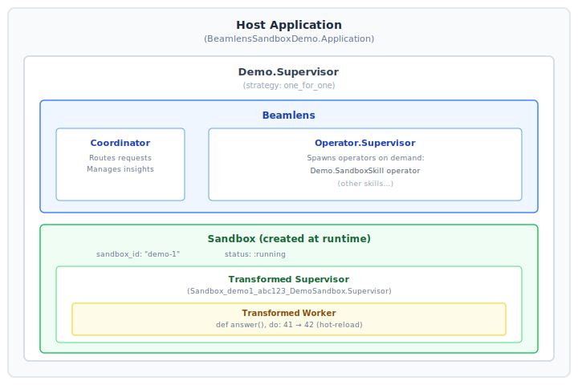

# Beamlens Sandbox Demo

A complete OTP application demonstrating the integration of [Sandbox](https://github.com/nshkrdotcom/sandbox) with [Beamlens](https://github.com/nshkrdotcom/beamlens), an AI-powered BEAM monitoring system.

This example shows how to:
- Create and manage sandboxes within a larger application
- Expose sandbox metrics through Beamlens skills
- Hot-reload code and verify changes via AI operators
- Test async, multi-component systems

## Table of Contents

1. [Project Goals](#project-goals)
2. [Architecture](#architecture)
3. [Project Structure](#project-structure)
4. [Component Deep Dive](#component-deep-dive)
5. [The Demo Flow](#the-demo-flow)
6. [Running the Demo](#running-the-demo)
7. [Testing](#testing)
8. [Extending the Example](#extending-the-example)
9. [Design Decisions](#design-decisions)

---

## Project Goals

### Primary Goal: Demonstrate Sandbox + AI Monitoring

The BEAM ecosystem has unique capabilities for introspection - you can query process info, inspect supervision trees, and monitor resource usage at runtime. Beamlens leverages these capabilities through AI-powered "operators" that can reason about system state.

This demo answers the question: **How do you monitor sandboxed code with AI?**

The answer involves:
1. Creating a Beamlens "Skill" that exposes sandbox metrics
2. Running an AI operator that queries those metrics
3. Having the operator produce insights about sandbox health

### Secondary Goal: Show Hot-Reload in Action

The demo performs a hot-reload that changes a function's return value from 41 to 42. This small change demonstrates the entire hot-reload pipeline:

1. Source code transformation (module prefixing)
2. In-process compilation
3. Code loading into a running sandbox
4. Verification that the change took effect

### Tertiary Goal: Provide a Testing Blueprint

The `test/` directory shows how to test systems with multiple async components (Sandbox, Beamlens, GenServers) without flaky tests.

---

## Architecture

### System Overview



### Data Flow During Demo


---

## Project Structure

```
beamlens_sandbox_demo/
├── lib/
│   └── demo/
│       ├── application.ex      # OTP Application entry point
│       ├── cli.ex              # Command-line interface
│       ├── sandbox_runner.ex   # Sandbox lifecycle helpers
│       ├── sandbox_skill.ex    # Beamlens skill for monitoring
│       ├── sandbox_skill/      # Skill state store (GenServer)
│       │   └── store.ex
│       └── sandbox_anomaly_skill.ex # Beamlens skill for anomaly demo
│
├── sandbox_app/                # Code that runs INSIDE the sandbox
│   ├── lib/
│   │   └── demo_sandbox/
│   │       ├── application.ex  # Sandboxed app entry
│   │       ├── supervisor.ex   # Sandboxed supervisor
│   │       └── worker.ex       # Sandboxed worker (the code we hot-reload)
│   └── mix.exs                 # Minimal mix.exs for compilation
│
├── test/
│   ├── demo/
│   │   └── sandbox_runner_test.exs  # Integration tests
│   └── test_helper.exs
│
├── mix.exs                     # Project configuration
├── mix.lock
├── .credo.exs                  # Credo configuration
└── .formatter.exs
```

### Why Two Codebases?

The `lib/` and `sandbox_app/` directories represent fundamentally different execution contexts:

**`lib/` (Host Context)**
- Runs in the main VM
- Has access to all dependencies (Beamlens, etc.)
- Manages sandbox lifecycle
- Never gets hot-reloaded

**`sandbox_app/` (Sandbox Context)**
- Compiled and loaded into the sandbox
- Module names are transformed (prefixed)
- Can be hot-reloaded at runtime
- Has limited access (security isolation)

This separation is intentional. In production, `sandbox_app/` might be user-submitted code, plugin code, or AI-generated code. It's treated as potentially untrusted.

---

## Component Deep Dive

### Demo.Application

```elixir
defmodule Demo.Application do
  use Application

  def start(_type, _args) do
    children = [
      {Beamlens, operators: [Demo.SandboxSkill, Demo.SandboxAnomalySkill]}
    ]
    Supervisor.start_link(children, strategy: :one_for_one, name: Demo.Supervisor)
  end
end
```

**Key Points:**

1. **Beamlens as Child**: We start Beamlens as a supervised child. This ensures Beamlens restarts if it crashes.

2. **`operators: [Demo.SandboxSkill, Demo.SandboxAnomalySkill]`**: This tells Beamlens to register both skills. The plumbing demo uses `Demo.SandboxSkill`; the anomaly demo uses `Demo.SandboxAnomalySkill` tuned for spike detection and notifications.

3. **No Sandbox Here**: Notice we don't start the Sandbox here. Sandboxes are created on-demand by `Demo.CLI`. This is intentional - sandboxes are ephemeral, while Beamlens is long-lived.

### Demo.SandboxRunner

This module provides high-level helpers for sandbox operations:

```elixir
defmodule Demo.SandboxRunner do
  def sandbox_path do
    Path.expand("../../sandbox_app", __DIR__)
  end

  def create_sandbox(sandbox_id, sandbox_path \\ sandbox_path()) do
    Sandbox.create_sandbox(sandbox_id, DemoSandbox.Supervisor, sandbox_path: sandbox_path)
  end

  def hot_reload(sandbox_id) do
    Sandbox.hot_reload_source(sandbox_id, hot_reload_source())
  end

  def run_in_sandbox(sandbox_id) do
    with {:ok, worker_module} <- resolve_module(sandbox_id, DemoSandbox.Worker) do
      Sandbox.run(sandbox_id, fn -> worker_module.answer() end, timeout: 5_000)
    end
  end

  # ...
end
```

**The Module Resolution Problem:**

When you create a sandbox, Sandbox transforms all module names. `DemoSandbox.Worker` becomes something like `Sandbox_demo1_abc123_DemoSandbox.Worker`. So how do you call the transformed module?

```elixir
defp resolve_module(sandbox_id, module) do
  module_name = module_name_without_elixir(module)

  case Sandbox.ModuleTransformer.lookup_module_mapping(sandbox_id, module_name) do
    {:ok, mapped} ->
      {:ok, normalize_module_atom(mapped)}

    :not_found ->
      # Fallback: construct from prefix
      case Sandbox.Manager.get_hot_reload_context(sandbox_id) do
        {:ok, %{module_namespace_prefix: prefix}} when is_binary(prefix) ->
          mapped = :"#{prefix}_#{module_name}"
          {:ok, normalize_module_atom(mapped)}

        _ ->
          {:error, :module_mapping_not_found}
      end
  end
end
```

This function tries two strategies:
1. **Direct Lookup**: Check if the module mapping was recorded during compilation
2. **Prefix Construction**: Build the transformed name from the known prefix

**The Hot-Reload Source:**

```elixir
defp hot_reload_source do
  """
  defmodule DemoSandbox.Worker do
    use GenServer

    def start_link(_opts) do
      GenServer.start_link(__MODULE__, :ready, [])
    end

    def answer do
      42  # Changed from 41!
    end

    @impl true
    def init(state) do
      {:ok, state}
    end
  end
  """
end
```

This is the "new version" that gets hot-reloaded. The key change: `answer/0` returns `42` instead of `41`.

### Demo.SandboxSkill

This is where Sandbox meets Beamlens. A "Skill" is Beamlens's abstraction for a monitoring capability.

```elixir
defmodule Demo.SandboxSkill do
  @behaviour Beamlens.Skill

  # Beamlens Skill Callbacks
  def title, do: "Sandbox"
  def description, do: "Sandbox: status and resource usage"

  def system_prompt do
    """
    You monitor a sandbox instance. Use the callbacks to read info and usage.
    Do not use think. Use snapshot data from take_snapshot() as the source of truth.

    If processes > 10:
      1) take_snapshot()
      2) send_notification(type: "process_spike", severity: "warning",
         summary: "process count elevated", snapshot_ids: ["latest"])
      3) set_state("warning", "process count above threshold")
      4) done()

    If processes <= 10:
      take_snapshot() then set_state("healthy", "process count normal") then done().

    Keep responses short and complete within 4 iterations.
    """
  end

  def snapshot do
    case Demo.SandboxSkill.Store.get_sandbox_id() do
      {:ok, sandbox_id} when is_binary(sandbox_id) -> snapshot_for(sandbox_id)
      {:ok, nil} -> %{error: "sandbox_id_not_configured"}
      {:error, reason} -> %{error: inspect(reason)}
    end
  end

  def callbacks do
    %{
      "sandbox_info" => fn -> sandbox_info() end,
      "sandbox_resource_usage" => fn -> sandbox_resource_usage() end
    }
  end

  # ...
end
```

**How Skills Work:**

1. **`title/0` and `description/0`**: Metadata for the Beamlens UI and operator context.

2. **`system_prompt/0`**: Instructions for the AI operator. This tells the LLM what it's monitoring and how to behave.

3. **`snapshot/0`**: Returns current state for the operator to analyze. Called at the start of each operator iteration.

4. **`callbacks/0`**: A map of functions the operator can call to gather more information. The operator decides when to call these based on the `system_prompt`.

5. **`callback_docs/0`**: Documentation for the callbacks, provided to the LLM so it knows what each callback does.

**Why a Store Process?**

The demo keeps the current sandbox id in a small GenServer store:

- Skills are stateless modules - they can't hold their own state
- The sandbox id needs to be accessible from any process
- A supervised store is explicit and restartable

The tradeoff is that this is global state - only one sandbox can be monitored at a time. In production, you'd want per-operator configuration.

### Demo.SandboxAnomalySkill

`Demo.SandboxAnomalySkill` reuses the same callbacks and snapshot format as
`Demo.SandboxSkill`, but it is tuned for spike detection and requires a
notification when a process spike is observed. This keeps the anomaly demo
deterministic and ensures the output reflects the injected load.

### DemoSandbox.Worker (sandbox_app/)

The code that actually runs inside the sandbox:

```elixir
defmodule DemoSandbox.Worker do
  use GenServer

  def start_link(_opts) do
    GenServer.start_link(__MODULE__, :ready, [])
  end

  def answer do
    41  # This becomes 42 after hot-reload
  end

  @impl true
  def init(state) do
    {:ok, state}
  end
end
```

**Why So Simple?**

This worker is intentionally minimal to demonstrate the core concept. In a real application, this might be:
- A plugin that processes user data
- An AI-generated function being evaluated
- A student's exercise submission being graded

The pattern remains the same: code loaded into an isolated sandbox, monitored by external systems.

### Demo.CLI

The command-line interface ties everything together:

```elixir
defmodule Demo.CLI do
  def run(opts \\ []) do
    sandbox_id = Keyword.get(opts, :sandbox_id, "demo-1")
    sandbox_path = Keyword.get(opts, :sandbox_path, SandboxRunner.sandbox_path())

    case SandboxRunner.create_sandbox(sandbox_id, sandbox_path) do
      {:ok, _info} ->
        log_demo("sandbox created: #{sandbox_id}")
        result = run_steps(sandbox_id, operator_runner, operator_opts)
        SandboxRunner.destroy_sandbox(sandbox_id)
        result

      {:error, reason} ->
        log_demo("sandbox create error: #{format_reason(reason)}")
        {:error, reason}
    end
  end

  defp run_steps(sandbox_id, operator_runner, operator_opts, mode, opts) do
    skill = operator_skill_for(mode, opts)

    with {:ok, :hot_reloaded} <- SandboxRunner.hot_reload(sandbox_id),
         :ok <- log_demo("hot reload: ok"),
         {:ok, run_result} <- SandboxRunner.run_in_sandbox(sandbox_id),
         :ok <- log_demo("run result: #{run_result}"),
         {:ok, anomaly_context} <- maybe_induce_anomaly(mode, sandbox_id, opts),
         :ok <- set_sandbox_target(sandbox_id),
         :ok <- validate_skill_snapshot(skill),
         {:ok, operator_summary} <-
           run_operator_and_log(
             operator_runner,
             skill,
             merge_operator_context(operator_opts, anomaly_context)
           ),
         :ok <- validate_operator_outcome(mode, sandbox_id, operator_summary) do
      {:ok, %{run_result: run_result, operator: operator_summary}}
    end
  end
end
```

**The `with` Chain:**

Each step depends on the previous succeeding:
1. Hot-reload the new code
2. Run `answer/0` in the sandbox (should return 42)
3. (Anomaly demo only) inject extra supervised worker processes
4. Configure the skill and verify the snapshot is live
5. Run the Beamlens operator
6. Return combined results

If any step fails, the `with` short-circuits and returns the error.

---

## The Demo Flow

Here's exactly what happens when you run `Demo.CLI.run()` (the anomaly demo
follows the same flow with the extra process-load step below):

### Step 1: Create Sandbox

```elixir
SandboxRunner.create_sandbox("demo-1", sandbox_path)
```

1. Sandbox reads `sandbox_app/lib/**/*.ex`
2. Compiles all files with module transformation
3. Creates a supervision tree for the sandbox
4. Starts `DemoSandbox.Supervisor` (transformed)
5. `DemoSandbox.Worker` starts as a child
6. Returns `{:ok, %{status: :running, ...}}`

At this point, `DemoSandbox.Worker.answer/0` returns `41`.

### Step 2: Hot Reload

```elixir
SandboxRunner.hot_reload("demo-1")
```

1. Takes the hot_reload_source string (with `answer/0 -> 42`)
2. Parses and transforms the AST (adds sandbox prefix)
3. Compiles to BEAM in memory
4. Calls `:code.load_binary/3` to load the new version
5. Old code is purged after no processes reference it
6. Returns `{:ok, :hot_reloaded}`

Now `DemoSandbox.Worker.answer/0` returns `42`.

### Step 3: Run in Sandbox

```elixir
SandboxRunner.run_in_sandbox("demo-1")
```

1. Resolves `DemoSandbox.Worker` to its transformed name
2. Calls `Sandbox.run/3` with a function that invokes `answer/0`
3. The function executes in the sandbox's process context
4. Returns `{:ok, 42}`

This proves the hot-reload worked.

### Step 3b: Inject Process Load (Anomaly Demo Only)

`Demo.CLI.run_anomaly/1` adds a process spike before the operator runs and
uses `Demo.SandboxAnomalySkill` to force a warning + notification flow:

```elixir
SandboxRunner.induce_process_load("demo-1", 25)
```

This starts additional supervised `Task` processes under
`DemoSandbox.Supervisor`, so `sandbox_resource_usage()` reports a higher
process count. The anomaly prompt tells the LLM to use snapshot data as the
source of truth, and the CLI validates the operator output against live
resource usage. If the operator claims `healthy` during a spike (or fails to
notify), the run fails fast.

The anomaly demo also allows more iterations (`operator_max_iterations`
defaults to 5) to complete `take_snapshot` → `send_notification` → `set_state`
→ `done`.

### Step 4: Set Sandbox Target and Validate Snapshot

```elixir
Demo.SandboxSkill.Store.set_sandbox_id("demo-1")
```

1. Stores the sandbox_id in a small GenServer store
2. Now `SandboxSkill.snapshot/0` will return data for "demo-1"
3. The CLI calls `snapshot/0` immediately to ensure live data is available

### Step 5: Run Operator

```elixir
run_operator(SandboxSkill, operator_opts)
```

1. Starts a `Beamlens.Operator` process
2. Operator calls `SandboxSkill.snapshot/0` to get current state
3. Operator may call callbacks like `sandbox_info()` or `sandbox_resource_usage()`
4. Operator produces a summary based on its analysis
5. Returns `{:ok, %{state: :healthy, summary: "...", notifications: 0}}`

For the anomaly demo, the operator is started with `Demo.SandboxAnomalySkill`
and a slightly higher `max_iterations` so it can complete the full
notification flow. After completion, the CLI compares the operator output to
the live process count and fails the run if they do not match.

### Step 6: Cleanup

```elixir
SandboxRunner.destroy_sandbox("demo-1")
```

1. Stops all processes in the sandbox supervision tree
2. Purges transformed modules from the code server
3. Cleans up ETS state
4. Returns `:ok`

---

## Running the Demo

### Prerequisites

```bash
# Elixir 1.18+ required
elixir --version

# Clone sandbox (if not already done)
git clone https://github.com/nshkrdotcom/sandbox.git
cd sandbox
```

### Setup

```bash
# Navigate to the demo
cd examples/beamlens_sandbox_demo

# Fetch dependencies
mix deps.get

# Compile
mix compile
```

### Run the CLI

```bash
# Demo 1: plumbing works (stable)
mix run -e "Demo.CLI.run()"

# Demo 2: anomaly detection (adds extra supervised workers)
mix run -e "Demo.CLI.run_anomaly()"

# Customize the sandbox ID or anomaly size
mix run -e "Demo.CLI.run(sandbox_id: \"my-sandbox\")"
mix run -e "Demo.CLI.run_anomaly(sandbox_id: \"my-sandbox\", process_load: 50)"
```

The anomaly demo injects extra supervised worker processes (default: 25) and
asks the operator to warn when the process count exceeds a small threshold.
Adjust with `process_load` or provide a custom `operator_context`.

### LLM Provider Selection

`Demo.CLI` builds a BAML client registry from environment variables. It
defaults to Anthropic when no provider is specified.

Supported `BEAMLENS_DEMO_PROVIDER` values: `anthropic` (default), `google-ai`
(alias: `gemini-ai`), `openai`, `ollama`, and `mock` (deterministic/offline).

Default (Anthropic):

```bash
export ANTHROPIC_API_KEY="..."
mix run -e "Demo.CLI.run()"
```

Gemini (Google AI) example:

```bash
export BEAMLENS_DEMO_PROVIDER=google-ai  # or gemini-ai
export GOOGLE_API_KEY="..."
export BEAMLENS_DEMO_MODEL="gemini-flash-lite-latest"
mix run -e "Demo.CLI.run_anomaly()"
```

Mock (offline) example:

```bash
export BEAMLENS_DEMO_PROVIDER=mock
mix run -e "Demo.CLI.run()"
```

You can also pass an explicit `client_registry:` or `puck_client:` in
`Demo.CLI.run/1` or `Demo.CLI.run_anomaly/1` to bypass env selection.

### Expected Output

Demo 1 (plumbing, stable):

```
[demo] sandbox created: demo-1
[demo] hot reload: ok
[demo] run result: 42
[beamlens] state=healthy summary="sandbox stable"
[beamlens] notifications=0
[demo] sandbox destroyed
```

Demo 2 (anomaly, example output):

```
[demo] sandbox created: demo-1
[demo] hot reload: ok
[demo] run result: 42
[demo] process load injected: 25 extra workers
[beamlens] state=warning summary="process count elevated"
[beamlens] notifications=1
[demo] sandbox destroyed
```

The exact summary text can vary by model, but the anomaly demo should emit at
least one notification when the process count spikes.

### Failure Modes (Anomaly Demo)

The anomaly demo fails fast when the operator output does not match live
telemetry. Typical failure reasons:

- `{:skill_snapshot_failed, "sandbox_id_not_configured"}`: the skill store has no sandbox id yet.
- `{:skill_snapshot_failed, "store_not_running"}`: the skill store GenServer is not running.
- `{:anomaly_state_mismatch, processes, 10, state}`: operator state disagreed with live process count.
- `{:anomaly_notification_missing, processes, 10}`: process spike occurred but no notification was emitted.
- `{:anomaly_unexpected_notification, processes, 10}`: operator emitted a notification when no spike existed.

These failures are intentional guardrails to keep the demo honest.

### Troubleshooting

- `{:skill_snapshot_failed, "sandbox_id_not_configured"}` → call `Demo.SandboxSkill.Store.set_sandbox_id/1` before running the operator.
- `{:skill_snapshot_failed, "store_not_running"}` → ensure `Demo.SandboxSkill.Store` is started (it should be under `Demo.Application`).
- `{:anomaly_state_mismatch, ...}` / `{:anomaly_notification_missing, ...}` → rerun with a stronger model via `BEAMLENS_DEMO_MODEL` or raise `operator_max_iterations`.
- `{:anomaly_unexpected_notification, ...}` → ensure the spike is real by using `process_load` > 10 (default is 25).
- Provider/auth errors → confirm `BEAMLENS_DEMO_PROVIDER` matches the API key env var (`GOOGLE_API_KEY`, `ANTHROPIC_API_KEY`, etc), or use `mock` for offline runs.
- Running tests from the repo root → use `mix test.examples`.

### Interactive Exploration

```bash
iex -S mix
```

```elixir
# Create a sandbox manually
{:ok, info} = Demo.SandboxRunner.create_sandbox("manual-1")
# => {:ok, %{status: :running, ...}}

# Check what's running
Sandbox.list_sandboxes()
# => [%{id: "manual-1", status: :running}]

# Hot-reload
{:ok, :hot_reloaded} = Demo.SandboxRunner.hot_reload("manual-1")

# Run a function
{:ok, result} = Demo.SandboxRunner.run_in_sandbox("manual-1")
# => {:ok, 42}

# Get resource usage
Sandbox.resource_usage("manual-1")
# => {:ok, %{current_memory: 12345, current_processes: 2, ...}}

# Cleanup
Demo.SandboxRunner.destroy_sandbox("manual-1")
# => :ok
```

---

## Testing

### Running Tests

```bash
# Run all tests
mix test

# Run with verbose output
mix test --trace

# Run specific test file
mix test test/demo/sandbox_runner_test.exs
```

If you're running from the repo root, use:

```bash
mix test.examples
```

### Test Design Philosophy

The tests in this demo follow several principles:

#### 1. No Async for Stateful Tests

```elixir
use ExUnit.Case, async: false
```

Sandbox operations modify global state (ETS, code server). Running tests concurrently would cause interference.

#### 2. Always Clean Up

```elixir
test "create_sandbox returns running info", %{sandbox_path: sandbox_path} do
  sandbox_id = unique_id()
  result = SandboxRunner.create_sandbox(sandbox_id, sandbox_path)

  on_exit(fn -> SandboxRunner.destroy_sandbox(sandbox_id) end)  # Always cleanup

  assert {:ok, %{status: :running}} = result
end
```

`on_exit` ensures cleanup even if the test fails.

#### 3. Unique IDs Prevent Collision

```elixir
defp unique_id do
  "demo-test-#{System.unique_integer([:positive])}"
end
```

Each test gets a unique sandbox ID, preventing interference between tests.

#### 4. Test Integration, Not Internals

The tests verify observable behavior:
- "sandbox creation returns running status"
- "hot-reload changes the function's return value"
- "skill snapshot includes sandbox ID"

They don't test internal implementation details that might change.

### Test File Walkthrough

```elixir
defmodule Demo.SandboxRunnerTest do
  use ExUnit.Case, async: false

  alias Demo.SandboxRunner
  alias Demo.SandboxSkill

  setup do
    Application.ensure_all_started(:beamlens_sandbox_demo)
    %{sandbox_path: SandboxRunner.sandbox_path()}
  end

  test "run_in_sandbox returns 42 after hot reload", %{sandbox_path: sandbox_path} do
    {_sandbox_id, result} =
      with_sandbox(sandbox_path, fn sandbox_id ->
        SandboxRunner.hot_reload(sandbox_id)
        SandboxRunner.run_in_sandbox(sandbox_id)
      end)

    assert {:ok, 42} = result
  end

  defp with_sandbox(sandbox_path, fun) do
    sandbox_id = unique_id()
    {:ok, _info} = SandboxRunner.create_sandbox(sandbox_id, sandbox_path)

    try do
      {sandbox_id, fun.(sandbox_id)}
    after
      SandboxRunner.destroy_sandbox(sandbox_id)
      SandboxSkill.Store.clear()
    end
  end
end
```

The `with_sandbox/2` helper encapsulates the create-use-destroy pattern, ensuring consistent cleanup.

---

## Extending the Example

### Adding More Skill Callbacks

```elixir
def callbacks do
  %{
    "sandbox_info" => fn -> sandbox_info() end,
    "sandbox_resource_usage" => fn -> sandbox_resource_usage() end,
    # Add new callbacks:
    "sandbox_module_versions" => fn -> get_module_versions() end,
    "sandbox_process_tree" => fn -> get_process_tree() end
  }
end

defp get_module_versions do
  case Demo.SandboxSkill.Store.get_sandbox_id() do
    {:ok, id} when is_binary(id) ->
      case Sandbox.Manager.get_sandbox_info(id) do
        {:ok, info} ->
          %{modules: info.loaded_modules, versions: info.module_versions}
        _ ->
          %{error: "sandbox not found"}
      end

    {:ok, nil} ->
      %{error: "sandbox_id_not_configured"}

    {:error, reason} ->
      %{error: inspect(reason)}
  end
end
```

### Monitoring Multiple Sandboxes

The current implementation monitors one sandbox at a time. For multiple sandboxes,
use a store that tracks a list of sandbox ids and have the skill read from it:

```elixir
defmodule Demo.MultiSandboxSkill do
  @behaviour Beamlens.Skill

  def snapshot do
    case Demo.MultiSandboxStore.get_sandbox_ids() do
      {:ok, sandbox_ids} ->
        Enum.map(sandbox_ids, fn id ->
          case Sandbox.resource_usage(id) do
            {:ok, usage} -> %{id: id, status: :ok, usage: usage}
            {:error, reason} -> %{id: id, status: :error, reason: inspect(reason)}
          end
        end)

      {:error, reason} ->
        [%{status: :error, reason: inspect(reason)}]
    end
  end
end
```

Set sandbox ids with `Demo.MultiSandboxStore.set_sandbox_ids/1` from your CLI
or supervisor before starting the operator.

### Adding Health Checks

```elixir
def callbacks do
  %{
    # ... existing callbacks ...
    "health_check" => fn -> perform_health_check() end
  }
end

defp perform_health_check do
  case Demo.SandboxSkill.Store.get_sandbox_id() do
    {:ok, id} when is_binary(id) ->
      checks = [
        {:sandbox_exists, sandbox_exists?(id)},
        {:processes_healthy, processes_healthy?(id)},
        {:memory_ok, memory_within_limits?(id)}
      ]

      failed = Enum.filter(checks, fn {_, ok} -> not ok end)

      %{
        healthy: Enum.empty?(failed),
        checks: Map.new(checks),
        failed: Enum.map(failed, &elem(&1, 0))
      }

    {:ok, nil} ->
      %{healthy: false, reason: "sandbox_id_not_configured"}

    {:error, reason} ->
      %{healthy: false, reason: inspect(reason)}
  end
end
```

---

## Design Decisions

### Why Separate `lib/` and `sandbox_app/`?

**Trust Boundaries**: Code in `lib/` is trusted (you wrote it). Code in `sandbox_app/` might not be (could be user-submitted). Keeping them separate makes the trust boundary explicit.

**Compilation Units**: They compile separately. `sandbox_app/` is compiled when the sandbox is created, not when the host app compiles.

**Hot-Reload Scope**: Only `sandbox_app/` code gets hot-reloaded. You never hot-reload `Demo.CLI` or `Demo.SandboxSkill`.

### Why Use Beamlens for Monitoring?

Beamlens provides AI-powered operators that can:
1. Understand system state in context
2. Decide what to investigate based on anomalies
3. Produce human-readable summaries

For sandbox monitoring, this means you get intelligent health reports, not just raw metrics.

### Why a GenServer Store for Sandbox Selection?

Options considered:
1. **Pass sandbox id in context**: clean, but Beamlens snapshots/callbacks are 0-arity, so you still need shared lookup.
2. **ETS/persistent_term**: fast, but implicit global state and harder to restart cleanly.
3. **GenServer store**: explicit, supervised, restartable, and aligned with the Beamlens store pattern.

The downside is still global state, so this demo only monitors one sandbox at a time. Production code should
use per-operator configuration or a per-operator store process.

### Why Does `run_in_sandbox` Return `{:ok, 42}` Not Just `42`?

Defensive design. Inside a sandbox, anything can go wrong:
- The module might not exist (hot-reload failed)
- The function might raise
- The sandbox might be dead

Wrapping in `{:ok, result}` or `{:error, reason}` makes error handling explicit and forces callers to consider failure modes.

---

## Troubleshooting

### "Sandbox not found" Errors

The sandbox was destroyed or never created. Check:
```elixir
Sandbox.list_sandboxes()
```

### Hot-Reload Seems to Have No Effect

1. Verify the reload succeeded:
   ```elixir
   {:ok, :hot_reloaded} = SandboxRunner.hot_reload(sandbox_id)
   ```

2. Verify you're calling the right module:
   ```elixir
   {:ok, module} = resolve_module(sandbox_id, DemoSandbox.Worker)
   IO.inspect(module)  # Should be Sandbox_xxx_DemoSandbox.Worker
   ```

3. Check the function is actually different:
   ```elixir
   # Before hot-reload
   SandboxRunner.run_in_sandbox(sandbox_id)  # => {:ok, 41}

   SandboxRunner.hot_reload(sandbox_id)

   # After hot-reload
   SandboxRunner.run_in_sandbox(sandbox_id)  # => {:ok, 42}
   ```

### Beamlens Operator Timeout

The operator has a default timeout of 30 seconds. If your callbacks are slow:
```elixir
Demo.CLI.run(operator_timeout: 60_000)  # 60 second timeout
```

### Tests Fail Intermittently

Likely a cleanup issue. Ensure every test uses `on_exit` or `with_sandbox` for cleanup. Also verify `async: false` is set.

---

## References

- [Sandbox Documentation](../../README.md)
- [Getting Started Guide](../../guides/getting_started.md)
- [Hot Reload Guide](../../guides/hot_reload.md)
- [Architecture Guide](../../guides/architecture.md)
- [Beamlens Repository](https://github.com/nshkrdotcom/beamlens)
- [BEAM Hot Code Loading](https://www.erlang.org/doc/reference_manual/code_loading.html)

---

## License

This example is part of the Sandbox project and is licensed under the MIT License.
